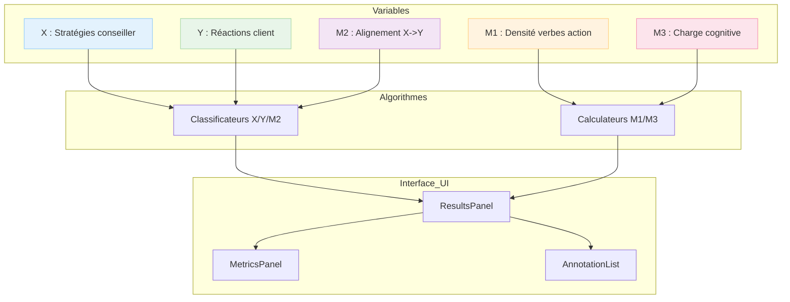
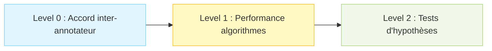

# AlgorithmLab - Quick Start

**En 5 minutes, comprendre l'essentiel.**

---

## 🎯 C'est quoi AlgorithmLab ?

**Framework de validation scientifique** pour algorithmes de tagging conversationnel.

### En une phrase

> AlgorithmLab permet de  **tester** , **comparer** et **améliorer** des algorithmes qui analysent automatiquement des conversations (stratégies conseiller, réactions client, métriques linguistiques).

---

## 🚀 Cas d'usage principaux

### 1. 🧪 Tester un algorithme (Level 1)

<pre class="overflow-visible!" data-start="924" data-end="1159">

<code class="whitespace-pre! language-typescript">// Interface de test automatique
import { BaseAlgorithmTesting } from"./components";

<BaseAlgorithmTesting
  variableLabel="M1 — Densité de verbes d'action"
  defaultClassifier="M1ActionVerbCounter"
  target="M1"
/>
</code>

</pre>

→ Voir [Level1Interface](01-ARCHITECTURE/README.md)

### 2. 🔧 Créer un nouvel algorithme

<pre class="overflow-visible!" data-start="1252" data-end="1828">

<code class="whitespace-pre! language-typescript">// Exemple : Calculateur M1 (verbes d'action)
exportclassMyM1CalculatorextendsBaseM1Calculator {
  asyncrun(input: M1Input) {
    const tokens = input.text.split(/\s+/);
    const actionVerbs = tokens.filter(t => this.isActionVerb(t));
    const density = (actionVerbs.length / tokens.length) * 100;
  
    return {
      prediction: density.toFixed(2),
      confidence: 0.8,
      details: {
        value: density,
        actionVerbCount: actionVerbs.length,
        totalTokens: tokens.length,
        verbsFound: actionVerbs,
      },
    };
  }
}
</code>

</pre>

→ [Tutoriel complet](03-DEVELOPER-GUIDES/add-new-algorithm.md)

### 3. 📊 Afficher des résultats

<pre class="overflow-visible!" data-start="1928" data-end="2125">

<code class="whitespace-pre! language-typescript">// Composant de visualisation adaptatif
<ResultsPanel
  results={validationResults}
  targetKind="M1"// X/Y/M1/M2/M3
  classifierLabel="M1 Counter v1.0"
  initialPageSize={50}
/>
</code>

</pre>

→ [API ResultsPanel](04-API-REFERENCE/components/results-panel.md)

---

## → [Architecture détaillée](01-ARCHITECTURE/README.md)

## 🏗️ Architecture en 1 image

---

## 📚 Les 5 variables expliquées

| Variable     | Type           | Exemple                  | Usage                         |
| ------------ | -------------- | ------------------------ | ----------------------------- |
| **X**  | Classification | ENGAGEMENT, REFLET_VOUS  | Stratégies du conseiller     |
| **Y**  | Classification | POSITIF, NEGATIF         | Réactions du client          |
| **M1** | Numérique     | 22.5 (verbes/100 tokens) | Densité verbes d'action      |
| **M2** | Classification | FORT, FAIBLE             | Alignement conseiller↔client |
| **M3** | Numérique     | 750ms                    | Charge cognitive (pauses)     |

→ [Détails complets](02-CORE-CONCEPTS/variables.md)

---

## 🎓 Workflow de validation scientifique

## 🎓 Workflow de validation scientifique

### Level 0 : Gold Standard

* Mesure accord entre experts (Kappa Cohen)
* Résolution désaccords

→ [En savoir plus](02-CORE-CONCEPTS/validation-levels.md#level0)

### Level 1 : Performance (⭐ Focus actuel)

* Tests algorithmes individuels
* Comparaison multi-algorithmes
* Métriques : Accuracy, F1, MAE, RMSE

→ [En savoir plus](02-CORE-CONCEPTS/validation-levels.md#level1)

### Level 2 : Hypothèses scientifiques

* H1 : Efficacité communication
* H2 : Charge cognitive
* H3 : Apprentissage organisationnel

→ [En savoir plus](02-CORE-CONCEPTS/validation-levels.md#level2)

---

## 🔍 Prochaines étapes recommandées

### 👨‍💻 Tu es développeur ?

* **Architecture** → [Vue d&#39;ensemble](01-ARCHITECTURE/README.md) (10 min)
* **Tutoriel** → [Créer un algorithme M1](03-DEVELOPER-GUIDES/add-new-algorithm.md) (30 min)
* **API Reference** → [Types et interfaces](04-API-REFERENCE/README.md)

### 🎓 Tu cherches à comprendre ?

* **Variables** → [X/Y/M1/M2/M3 expliquées](02-CORE-CONCEPTS/variables.md)
* **Métriques** → [Accuracy, MAE, Kappa, etc.](02-CORE-CONCEPTS/metrics.md)
* **ADRs** → [Décisions d&#39;architecture](05-ARCHITECTURE-DECISIONS/README.md)

### 🐛 Tu as un problème ?

* **Troubleshooting** → [FAQ &amp; Solutions](06-MAINTENANCE/troubleshooting.md)
* **Migration** → [Guides de migration](06-MAINTENANCE/migration-guides/)

---

## 💡 Concepts clés à retenir

### 🎯 Variables = Cibles d'analyse

Chaque algorithme cible une variable spécifique (X, Y, M1, M2 ou M3).

### 🔧 Adaptateur universel

Tous les algorithmes passent par `createUniversalAlgorithm()` pour unifier les interfaces.

### 📊 Métriques adaptatives

* **Classification** (X/Y/M2) → Accuracy, Precision, Recall, F1, Kappa
* **Numérique** (M1/M3) → MAE, RMSE, R², corrélation

### 🏷️ Colonnes dynamiques

Le système `extraColumns` injecte automatiquement les bonnes colonnes selon la variable.

---

## 🎬 Exemple complet de bout en bout

<pre class="overflow-visible!" data-start="5883" data-end="6399">

<code class="whitespace-pre! language-typescript">// 1. Créer un algorithme M1
classMyM1extendsBaseM1Calculator {
  asyncrun(input: M1Input) {
    /* ... */
  }
}

// 2. L'enregistrer
const universal = createUniversalAlgorithm(newMyM1(), "M1");
algorithmRegistry.register("MyM1", universal);

// 3. L'utiliser dans l'UI
<BaseAlgorithmTesting
  variableLabel="M1 — Mon calculateur"
  defaultClassifier="MyM1"
  target="M1"
/>

// 4. Afficher les résultats
<ResultsPanel
  results={testResults}
  targetKind="M1"
  classifierLabel="MyM1 v1.0"
/>
</code>

</pre>

→ [Code source complet](03-DEVELOPER-GUIDES/add-new-algorithm.md)

---

## ❓ Questions fréquentes

**Q : Quelle est la différence entre X et Y ?**

→ X = stratégies du conseiller, Y = réactions du client

**Q : M1/M2/M3 c'est quoi ?**

→ Médiateurs : M1 (verbes action), M2 (alignement), M3 (charge cognitive)

**Q : Comment choisir entre classification et calcul ?**

→ Classification = catégories discrètes (X/Y/M2), Calcul = valeurs continues (M1/M3)

**Q : Où sont les algorithmes existants ?**

→ `src/app/(protected)/analysis/components/AlgorithmLab/algorithms/level1/`

**Q : Comment tester mon algorithme ?**

→ Utilise `BaseAlgorithmTesting` avec `target="M1"` (ou X/Y/M2/M3)

→ [Plus de questions](06-MAINTENANCE/troubleshooting.md)

---

## 📖 Ressources utiles

* **Documentation complète** : [Index](README.md)
* **Architecture** : [Design patterns](01-ARCHITECTURE/design-patterns.md)
* **Types** : [Système de types](01-ARCHITECTURE/type-system.md)
* **API** : [Référence complète](04-API-REFERENCE/README.md)

---

⏱️ **Temps de lecture** : ~5 minutes

🎯 **Prochaine étape recommandée** : [Architecture Overview](01-ARCHITECTURE/README.md)

