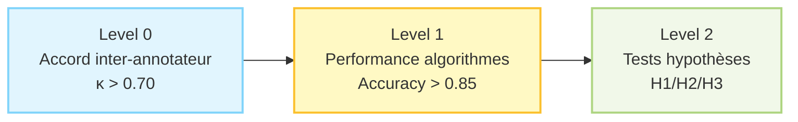
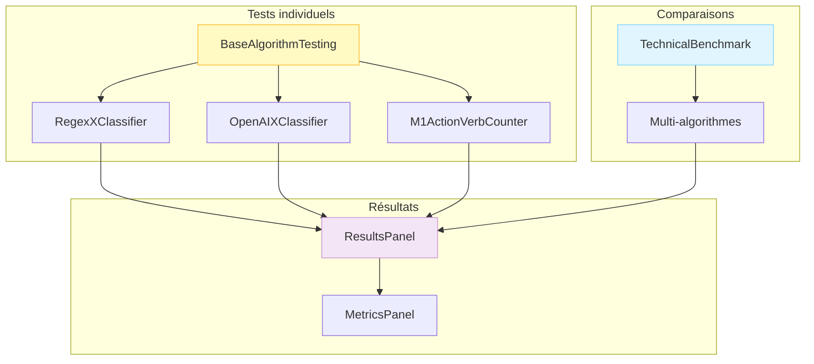
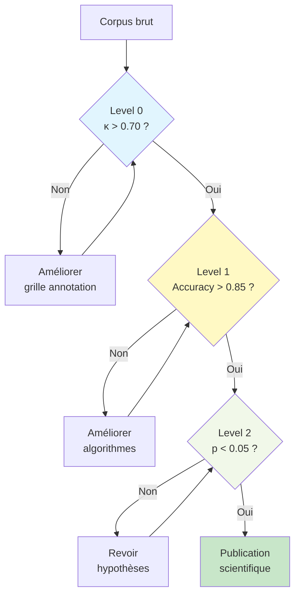


# Niveaux de validation AlgorithmLab

**Workflow scientifique de validation en 3 étapes**

---

## 🎯 Vue d'ensemble

AlgorithmLab structure la validation scientifique en **3 niveaux hiérarchiques** :



| Level             | Objectif        | Métriques clés          | Status                   |
| ----------------- | --------------- | ------------------------- | ------------------------ |
| **Level 0** | Gold standard   | Kappa de Cohen            | ✅ Validé               |
| **Level 1** | Validation algo | Accuracy, F1, MAE         | ⭐**Focus actuel** |
| **Level 2** | Hypothèses     | Corrélations, Tests stat | 🔜 À venir              |

---

## 📊 Level 0 : Accord inter-annotateur

### Objectif

Établir un **gold standard fiable** en mesurant l'accord entre annotateurs experts humains.

**Principe fondamental** : Avant de valider des algorithmes, il faut s'assurer que les humains sont d'accord entre eux sur l'annotation.

---

### Méthodologie

#### 1. Protocole de double annotation

**Échantillon** :

- 200 paires adjacentes (tour conseiller + réaction client)
- Répartition équilibrée entre les catégories X/Y
- Couverture de tous les secteurs d'activité du corpus

**Formation** :

- 20 heures de formation pour le second annotateur
- 8h théorie (AC, LI, conflits conversationnels)
- 8h pratique (50 paires pilotes)
- 4h validation (30 paires test, κ > 0.65 requis)

**Processus** :

```typescript
// Workflow de double annotation
interface AnnotationPair {
  turnId: number;
  verbatim: string;
  annotator1: {
    label: VariableX | VariableY;
    confidence: number;
    rationale: string;
  };
  annotator2: {
    label: VariableX | VariableY;
    confidence: number;
    rationale: string;
  };
  agreement: boolean;
  resolved?: string; // Si désaccord résolu
}
```

#### 2. Calcul du Kappa de Cohen

**Formule** :

```
κ = (P₀ - Pₑ) / (1 - Pₑ)

Où :
- P₀ = Accord observé
- Pₑ = Accord attendu par hasard
```

**Implémentation** : Voir [metrics.md](metrics.md#5-cohens-kappa-κ)

**Seuils d'interprétation (Landis & Koch, 1977)** :

- **κ > 0.80** : Accord quasi-parfait ✅
- **κ = 0.61-0.80** : Accord substantiel ✅
- **κ = 0.41-0.60** : Accord modéré ⚠️
- **κ < 0.40** : Accord insuffisant ❌

#### 3. Résolution des désaccords

**Processus en 3 étapes** :

1. **Discussion** : Confrontation des rationales
2. **Recours au guide** : Consultation des définitions/exemples
3. **Décision arbitrale** : Annotateur principal tranche + documentation

**Exemple de cas résolu** :

```typescript
// Tour : "D'accord, je vais vérifier votre dossier"
// Annotateur 1 : REFLET_ACQ (focus sur "d'accord")
// Annotateur 2 : ENGAGEMENT (focus sur "je vais vérifier")
// → Résolution : ENGAGEMENT (règle de priorité action)
```

---

### Résultats attendus

| Variable                 | Kappa cible | Interprétation               |
| ------------------------ | ----------- | ----------------------------- |
| **X (conseiller)** | > 0.70      | Accord substantiel minimum    |
| **Y (client)**     | > 0.70      | Accord substantiel minimum    |
| **Par catégorie** | Variable    | ENGAGEMENT/OUVERTURE > REFLET |

**Exemple de rapport Level 0** :

```typescript
{
  "overallKappa": 0.74,
  "byVariable": {
    "X": {
      "kappa": 0.76,
      "byCategory": {
        "ENGAGEMENT": 0.85,
        "OUVERTURE": 0.82,
        "REFLET_VOUS": 0.68,
        "REFLET_JE": 0.71,
        "REFLET_ACQ": 0.73,
        "EXPLICATION": 0.67
      }
    },
    "Y": {
      "kappa": 0.78,
      "byCategory": {
        "CLIENT_POSITIF": 0.82,
        "CLIENT_NEGATIF": 0.80,
        "CLIENT_NEUTRE": 0.68
      }
    }
  },
  "totalSamples": 200,
  "agreements": 168,
  "disagreements": 32
}
```

---

## 🧪 Level 1 : Performance des algorithmes

### Objectif

Valider la **performance individuelle** de chaque algorithme sur le gold standard établi en Level 0.

**Focus actuel** : ⭐ C'est le niveau prioritaire d'AlgorithmLab.

---

### Architecture



---

### 1. Tests individuels (BaseAlgorithmTesting)

**Interface principale** :

```typescript
<BaseAlgorithmTesting
  variableLabel="M1 — Densité de verbes d'action"
  defaultClassifier="M1ActionVerbCounter"
  target="M1"
/>
```

**Workflow de test** :

#### Étape 1 : Sélection de l'algorithme

```typescript
// Registry lookup
const algo = algorithmRegistry.get("M1ActionVerbCounter");
const metadata = algo.describe();

console.log(metadata);
// {
//   name: "M1ActionVerbCounter",
//   displayName: "M1 — Densité de verbes d'action",
//   type: "metric",
//   target: "M1",
//   batchSupported: true
// }
```

#### Étape 2 : Exécution du test

```typescript
async function runTest(
  algorithm: UniversalAlgorithm,
  testSet: TestSample[],
  sampleSize: number = 100
): Promise<ValidationResults> {
  const results: UniversalResult[] = [];
  const startTime = Date.now();
  
  // Sélection aléatoire
  const samples = testSet
    .sort(() => Math.random() - 0.5)
    .slice(0, sampleSize);
  
  // Exécution
  for (const sample of samples) {
    const result = await algorithm.run(sample.input);
    results.push({
      ...result,
      goldStandard: sample.goldStandard,
      correct: result.prediction === sample.goldStandard
    });
  }
  
  const totalTime = Date.now() - startTime;
  
  return {
    algorithmName: algorithm.describe().name,
    results,
    metrics: calculateMetrics(results),
    performance: {
      totalTime,
      avgTime: totalTime / samples.length,
      samplesProcessed: samples.length
    }
  };
}
```

#### Étape 3 : Calcul des métriques

**Dispatch automatique selon target** :

```typescript
function calculateMetrics(
  results: UniversalResult[]
): ClassificationMetrics | NumericalMetrics {
  const target = results[0]?.metadata?.target;
  
  switch (target) {
    case "X":
    case "Y":
    case "M2":
      return {
        accuracy: calculateAccuracy(results),
        precision: calculatePrecisionPerClass(results),
        recall: calculateRecallPerClass(results),
        f1Score: calculateF1PerClass(results),
        kappa: calculateCohenKappa(results),
        confusionMatrix: buildConfusionMatrix(results)
      };
    
    case "M1":
    case "M3":
      return {
        mae: calculateMAE(results),
        rmse: calculateRMSE(results),
        r2: calculateR2(results),
        pearson: calculatePearsonCorrelation(results),
        spearman: calculateSpearmanCorrelation(results)
      };
  }
}
```

#### Étape 4 : Affichage des résultats

```typescript
<ResultsPanel
  results={validationResults}
  targetKind="M1"
  classifierLabel="M1 Action Verb Counter v1.0"
  initialPageSize={50}
/>
```

**Affichage adaptatif** :

- **Classification (X/Y/M2)** : Colonnes `Prediction`, `Gold Standard`, `Correct`, `Confidence`, `Family`, `Evidences`
- **Numérique (M1/M3)** : Colonnes `Prediction`, `Gold Standard`, `Error`, `Absolute Error`, `Details`

---

### 2. Comparaisons multi-algorithmes (TechnicalBenchmark)

**Interface** :

```typescript
<TechnicalBenchmark
  benchmarkResults={[
    {
      algorithmName: "M1ActionVerbCounter",
      metrics: { mae: 2.45, rmse: 3.12, r2: 0.89 },
      performance: { avgTime: 8.5 }
    },
    {
      algorithmName: "RegexM1Calculator",
      metrics: { mae: 3.67, rmse: 4.88, r2: 0.72 },
      performance: { avgTime: 3.2 }
    }
  ]}
/>
```

**Tableau comparatif généré** :

| Algorithme          | Type       | MAE ↓         | RMSE | R² ↑         | Temps (ms)    | Score |
| ------------------- | ---------- | -------------- | ---- | -------------- | ------------- | ----- |
| M1ActionVerbCounter | metric     | **2.45** | 3.12 | **0.89** | 8.5           | 🥇    |
| RegexM1Calculator   | rule-based | 3.67           | 4.88 | 0.72           | **3.2** | 🥈    |

**Calcul du score global** :

```typescript
function calculateOverallScore(metrics: Metrics): number {
  if ('mae' in metrics) {
    // Numérique : favorise MAE faible et R² élevé
    return (1 - metrics.mae / 10) * 0.4 + metrics.r2 * 0.6;
  } else {
    // Classification : favorise F1 et Kappa élevés
    const avgF1 = Object.values(metrics.f1Score)
      .reduce((sum, f1) => sum + f1, 0) / 
      Object.keys(metrics.f1Score).length;
    return avgF1 * 0.6 + metrics.kappa * 0.4;
  }
}
```

---

### 3. Métriques par type de variable

#### Classification (X, Y, M2)

**Exemple : OpenAIXClassifier**

```typescript
{
  "accuracy": 0.87,
  "kappa": 0.82,
  "f1Score": {
    "ENGAGEMENT": 0.89,
    "OUVERTURE": 0.85,
    "REFLET_VOUS": 0.78,
    "REFLET_JE": 0.82,
    "REFLET_ACQ": 0.91,
    "EXPLICATION": 0.76
  },
  "precision": { /* ... */ },
  "recall": { /* ... */ },
  "confusionMatrix": { /* ... */ }
}
```

**Interprétation** :

- ✅ **Accuracy 0.87** : Très bon (> 0.85)
- ✅ **Kappa 0.82** : Accord quasi-parfait (> 0.80)
- ⚠️ **EXPLICATION F1=0.76** : Catégorie la plus difficile (< 0.80)

#### Numérique (M1, M3)

**Exemple : M1ActionVerbCounter**

```typescript
{
  "mae": 2.45,
  "rmse": 3.12,
  "r2": 0.892,
  "pearson": 0.944,
  "spearman": 0.927
}
```

**Interprétation** :

- ✅ **MAE 2.45** : Excellent (< 3 verbes/100 tokens)
- ✅ **R² 0.89** : Très bon pouvoir prédictif
- ✅ **Corrélation 0.94** : Forte relation linéaire

---

### 4. Seuils de validation Level 1

**Critères de passage en production** :

| Métrique             | Classification | Numérique   | Seuil minimal |
| --------------------- | -------------- | ------------ | ------------- |
| **Qualité**    | Accuracy       | R²          | > 0.85        |
| **Consistance** | Kappa          | Corrélation | > 0.70        |
| **Équilibre**  | F1 moyen       | MAE          | > 0.75 / < 5  |
| **Performance** | Temps/sample   | Temps/sample | < 100ms       |

**Exemple de décision** :

```typescript
function shouldDeployAlgorithm(
  metrics: Metrics,
  performance: Performance
): boolean {
  if ('accuracy' in metrics) {
    // Classification
    return (
      metrics.accuracy > 0.85 &&
      metrics.kappa > 0.70 &&
      performance.avgTime < 100
    );
  } else {
    // Numérique
    return (
      metrics.r2 > 0.85 &&
      metrics.mae < 5 &&
      performance.avgTime < 100
    );
  }
}
```

---

### 5. Workflow complet Level 1

```typescript
// 1. Initialiser les algorithmes
initializeAlgorithms();

// 2. Charger le gold standard
const goldStandard = await loadGoldStandard({
  variable: "X",
  minSamples: 100,
  balanced: true
});

// 3. Tester tous les algos disponibles
const algorithms = algorithmRegistry.list()
  .filter(({ meta }) => meta.target === "X");

const results = [];
for (const { key } of algorithms) {
  const algo = algorithmRegistry.get(key);
  const result = await runTest(algo, goldStandard, 100);
  results.push(result);
}

// 4. Comparer et identifier le meilleur
const ranked = results.sort((a, b) => 
  b.metrics.accuracy - a.metrics.accuracy
);

console.log("🏆 Meilleur algorithme:", ranked[0].algorithmName);
console.log("📊 Accuracy:", ranked[0].metrics.accuracy);

// 5. Générer le rapport
generateLevel1Report({
  variable: "X",
  results,
  bestAlgorithm: ranked[0],
  timestamp: new Date()
});
```

---

## 🔬 Level 2 : Tests d'hypothèses scientifiques

### Objectif

Valider les **hypothèses théoriques** de la thèse sur les relations entre variables.

**Status** : 🔜 À venir (après validation Level 1)

---

### Hypothèses à tester

#### H1 : Efficacité de la communication

**Prédiction** :

```
ENGAGEMENT/OUVERTURE → CLIENT_POSITIF
    (plus probable que)
EXPLICATION → CLIENT_POSITIF
```

**Test statistique** :

- Chi² d'indépendance pour X → Y
- Régression logistique avec contrôles
- Calcul de l'effet (odds ratio)

**Implémentation attendue** :

```typescript
interface H1Test {
  hypothesis: "ENGAGEMENT/OUVERTURE → CLIENT_POSITIF";
  method: "chi2" | "logistic_regression";
  results: {
    statistic: number;
    pValue: number;
    effectSize: number;
    significant: boolean; // p < 0.05
  };
}

async function testH1(corpus: AnnotatedPairs[]): Promise<H1Test> {
  // Regrouper par stratégie conseiller
  const actionStrategies = corpus.filter(p => 
    p.x === "ENGAGEMENT" || p.x === "OUVERTURE"
  );
  const explanations = corpus.filter(p => 
    p.x === "EXPLICATION"
  );
  
  // Calculer taux de réactions positives
  const actionPositiveRate = 
    actionStrategies.filter(p => p.y === "CLIENT_POSITIF").length / 
    actionStrategies.length;
  
  const explainPositiveRate = 
    explanations.filter(p => p.y === "CLIENT_POSITIF").length / 
    explanations.length;
  
  // Test Chi²
  const chi2Result = chiSquareTest(/* ... */);
  
  return {
    hypothesis: "ENGAGEMENT/OUVERTURE → CLIENT_POSITIF",
    method: "chi2",
    results: {
      statistic: chi2Result.statistic,
      pValue: chi2Result.pValue,
      effectSize: actionPositiveRate - explainPositiveRate,
      significant: chi2Result.pValue < 0.05
    }
  };
}
```

#### H2 : Charge cognitive

**Prédiction** :

```
M1 (verbes action) ↓ → M3 (charge cognitive) ↓
EXPLICATION → M3 ↑ (surcharge)
```

**Test statistique** :

- Corrélation Pearson M1 ↔ M3
- ANOVA pour comparer M3 entre stratégies X
- Régression multiple M3 ~ M1 + X

#### H3 : Alignement comme médiateur

**Prédiction** :

```
X → M2 (alignement) → Y
M2 FORT amplifie l'effet positif de ENGAGEMENT
```

**Test statistique** :

- Analyse de médiation (Baron & Kenny, 1986)
- Modèles d'équations structurelles (SEM)
- Tests de modération

---

### Architecture Level 2 (future)

```typescript
interface Level2Interface {
  // Sélection hypothèse
  selectHypothesis: (h: "H1" | "H2" | "H3") => void;
  
  // Configuration test
  configureTest: {
    corpus: AnnotatedPairs[];
    controlVariables: string[];
    significanceLevel: number; // default: 0.05
  };
  
  // Exécution
  runHypothesisTest: () => Promise<HypothesisTestResult>;
  
  // Visualisations
  displayCorrelations: () => CorrelationMatrix;
  displayRegressionPlot: () => ScatterPlot;
  displayEffectSizes: () => BarChart;
}
```

---

## 📈 Progression entre les niveaux



**Critères de passage** :

| De → Vers                  | Condition               | Métriques                         |
| --------------------------- | ----------------------- | ---------------------------------- |
| **L0 → L1**          | Gold standard fiable    | κ > 0.70                          |
| **L1 → L2**          | Algorithmes validés    | Accuracy > 0.85, F1 > 0.75         |
| **L2 → Publication** | Hypothèses confirmées | p < 0.05, Effect size significatif |

---

## 🛠️ Outils disponibles

### Level 0

- Interface d'annotation double (externe, non implémentée dans AlgorithmLab)
- Calcul Kappa de Cohen (fonction utilitaire)

### Level 1 ⭐

- `BaseAlgorithmTesting` : Tests unitaires par algorithme
- `TechnicalBenchmark` : Comparaisons multi-algorithmes
- `ResultsPanel` : Affichage résultats
- `MetricsPanel` : Métriques adaptatives
- `algorithmRegistry` : Gestion centralisée

### Level 2

- 🔜 `HypothesisTestingPanel` (à développer)
- 🔜 `CorrelationMatrix` (à développer)
- 🔜 `StatisticalTests` utils (à développer)

---

## 📚 Ressources complémentaires

- **[Métriques](metrics.md)** - Formules détaillées
- **[Variables](variables.md)** - X/Y/M1/M2/M3
- **[Algorithmes](algorithms.md)** - Classification vs Calcul
- **[Architecture](../01-ARCHITECTURE/README.md)** - Vue d'ensemble technique

---

⏱️ **Temps de lecture** : ~15 minutes
🎯 **Focus actuel** : Level 1 (tests de performance)
🎯 **Prochaine étape** : [Guide développeur - Tests](../03-DEVELOPER-GUIDES/add-new-algorithm.md)
