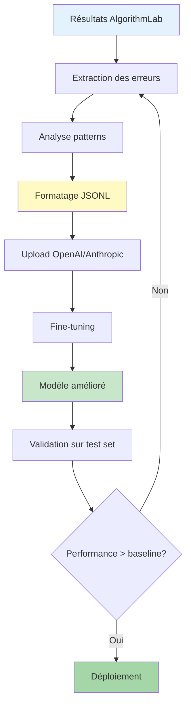


# 📘 Guide 5 : Pipeline de Fine-tuning

markdown

```markdown
# Pipeline de Fine-tuning

**Temps estimé** : 90-120 minutes  
**Niveau** : Avancé  
**Prérequis** : 
- Maîtrise de l'intégration LLM
- Compréhension des formats JSONL
- Lecture de [FineTuningDialog](../../../components/Level1/shared/results/base/ResultsSample/components/FineTuningDialog/)

---

## 🎯 Ce que tu vas apprendre

- Extraire des données d'entraînement depuis les résultats
- Formater les données au format JSONL (OpenAI/Anthropic)
- Générer un rapport d'analyse des erreurs
- Créer un pipeline complet d'amélioration continue
- Déployer un modèle fine-tuné

---

## 📁 Fichiers concernés
```

src/app/(protected)/analysis/components/AlgorithmLab/
├── components/Level1/shared/results/base/ResultsSample/
│   └── components/FineTuningDialog/
│       ├── FineTuningDialog.tsx          ← Dialog principal
│       ├── FineTuningExtractor.tsx       ← Extraction données
│       ├── FineTuningFormatter.tsx       ← Formatage JSONL
│       ├── FineTuningMetrics.tsx         ← Calcul métriques
│       └── hooks/
│           └── useFineTuningExtractor.ts ← Hook React
└── utils/
└── errorAnalysis.ts                  ← Analyse patterns d'erreurs

```

---

## 🚀 Étape 1 : Comprendre le workflow de fine-tuning

### Schéma du pipeline complet


### Principe fondamental

Le fine-tuning améliore un modèle en l'entraînant sur **les erreurs spécifiques** de ton domaine :

1. ✅ **Gold Standard** : Annotations expertes (vérité terrain)
2. ❌ **Prédictions incorrectes** : Cas où l'algo se trompe
3. 📊 **Patterns d'erreurs** : Confusions récurrentes
4. 🔧 **Exemples d'entraînement** : Pairs (input, output correct)
5. 🚀 **Nouveau modèle** : Fine-tuné sur ton corpus

---

## 🚀 Étape 2 : Extraire les données d'entraînement

### Fichier : `FineTuningExtractor.tsx`

typescript

```typescript
import{TVValidationResult,FineTuningData}from"../../types";
import{ formatFineTuningPrompt }from"./FineTuningFormatter";

exportclassFineTuningExtractor{
private results:TVValidationResult[];
private onProgress?:(current:number, total:number)=>void;

constructor(
    results:TVValidationResult[],
    onProgress?:(current:number, total:number)=>void
){
this.results= results;
this.onProgress= onProgress;
}

/**
   * Extrait les données d'entraînement
   * ✅ Focus sur les ERREURS (prédiction ≠ gold standard)
   */
asyncextract():Promise<string>{
console.log(`🔍 EXTRACTION pour ${this.results.length} résultats`);

// 1️⃣ Sélectionner uniquement les non-conformes (erreurs)
const misclassified =this.results.filter((r)=> r &&!r.correct);
console.log(
`📊 Non conformes: ${misclassified.length}/${this.results.length}`
);

if(misclassified.length===0){
console.warn("⚠️ Aucune erreur détectée, génération rapport vide");
returnformatFineTuningPrompt([],this.results);
}

// 2️⃣ Convertir chaque erreur en exemple d'entraînement
const trainingData:FineTuningData[]=[];
let processed =0;

for(const result of misclassified){
      processed++;
this.onProgress?.(processed, misclassified.length);

// Récupérer les annotations expertes si disponibles
const annotations =Array.isArray(result.metadata?.annotations)
?(result.metadata!.annotationsasany[])
:[];

const item =this.createFineTuningData(result, annotations);
      trainingData.push(item);
}

console.log(`🎯 Générés: ${trainingData.length} exemples d'entraînement`);

// 3️⃣ Formater le rapport complet
returnformatFineTuningPrompt(trainingData,this.results);
}

/**
   * Crée un exemple d'entraînement au format OpenAI
   */
privatecreateFineTuningData(
    result:TVValidationResult,
    annotations:any[]
):FineTuningData{
const m = result.metadata||{};

// Contexte conversationnel (tours adjacents)
const context ={
      prev2: m.prev2_turn_verbatim||null,
      prev1: m.prev1_turn_verbatim||null,
      current: result.verbatim,
      next1: m.next_turn_verbatim||null,
};

// Commentaires d'experts (optionnels mais recommandés)
const expertComments =
(annotations ||[])
.map(
(ann:any)=>
            ann?.rationale || ann?.comment || ann?.note || ann?.reason
)
.filter(Boolean)||[];

// Construction du prompt système
const systemHeader =
      expertComments.length>0
?`Tu es un expert en analyse conversationnelle. Analyse le tour de parole dans son contexte et attribue le bon tag selon les annotations d'experts.

Annotations disponibles :
${expertComments.map((c:string, i:number)=>`${i +1}. ${c}`).join("\n")}`
:`Tu es un expert en analyse conversationnelle. Analyse le tour de parole dans son contexte et attribue le bon tag en respectant la charte de taggage (ENGAGEMENT > OUVERTURE > REFLET_VOUS > REFLET_JE > REFLET_ACQ > EXPLICATION).`;

// Format OpenAI : messages système/utilisateur/assistant
return{
      messages:[
{ role:"system", content: systemHeader },
{
          role:"user",
          content:`Contexte conversationnel :
${context.prev2?`Tour -2: "${context.prev2}"`:""}
${context.prev1?`Tour -1: "${context.prev1}"`:""}
**Tour à analyser**: "${context.current}"
${context.next1?`Tour +1: "${context.next1}"`:""}

Algorithme actuel prédit: ${result.predicted} (confiance: ${(
(result.confidence||0)*100
).toFixed(1)}%)
Quel devrait être le bon tag selon vous ?`,
},
{
          role:"assistant",
          content:`Le tag correct est **${result.goldStandard}**.

${
  expertComments.length>0
?`Justification selon l'expert : ${expertComments[0]}`
:`Justification : application stricte de la charte (priorité à l'action).`
}

L'algorithme a ${
            result.predicted=== result.goldStandard
?"correctement"
:"incorrectement"
} prédit "${result.predicted}" au lieu de "${result.goldStandard}".`,
},
],
      metadata:{
        turnId:parseInt(String(m.turnId|| m.id||0),10),
        verbatim: result.verbatim,
        context,
        predicted: result.predicted,
        goldStandard: result.goldStandard,
        confidence: result.confidence,
        annotations: expertComments,
        algo:{
          classifier: m.classifier||"unknown",
          model: m.model||null,
          type: m.type||null,
          provider: m.provider||null,
          temperature: m.temperature||null,
          max_tokens: m.maxTokens||null,
},
},
};
}
}
```

---

## 🚀 Étape 3 : Formater les données (JSONL)

### Fichier : `FineTuningFormatter.tsx`

typescript

```typescript
import{FineTuningData,ExtractionStats}from"./types";
import{TVValidationResult}from"../../types";
import{ generateErrorAnalysis }from"../../utils/errorAnalysis";
import{
  computeMetrics,
  renderPerLabelTable,
  renderConfusion,
}from"./FineTuningMetrics";

/**
 * Génère le rapport complet de fine-tuning
 * Format : Markdown + JSONL + Analyse d'erreurs
 */
exportconst formatFineTuningPrompt =(
  trainingExamples:FineTuningData[],
  originalResults:TVValidationResult[]
):string=>{
const stats =calculateExtractionStats(trainingExamples, originalResults);
const m =computeMetrics(originalResults);

const hasTraining = trainingExamples.length>0;
const errorAnalysisBlock = hasTraining
?generateErrorAnalysis(trainingExamples)
:"_Aucun résultat non conforme dans l'échantillon. Rapport généré sans données d'entraînement (JSONL vide)._";

return`# Données d'entraînement pour fine-tuning d'algorithme de tagging conversationnel

## Contexte
Ces données proviennent d'un système d'analyse conversationnelle. Le jeu d'entraînement ci-dessous correspond aux **résultats non conformes** (prédiction ≠ gold).

## 📊 Statistiques globales
- **Total**: ${m.total} | **Corrects**: ${m.correct} | **Accuracy**: ${(
    m.accuracy*100
).toFixed(1)}%
- **Confiance moyenne**: ${(m.avgConfidence*100).toFixed(1)}%
- **Temps moyen**: ${m.avgProcessingTime} ms
- **Kappa (Cohen)**: ${m.kappa.toFixed(3)}
- **Algorithme source**: ${getAlgorithmInfo(originalResults)}
- **Résultats d'entraînement (non conformes)**: ${trainingExamples.length}/${
    originalResults.length
} (${stats.annotationCoverage.toFixed(1)}%)
- **Taux d'erreur global**: ${stats.errorRate.toFixed(1)}%

## 🎯 Métriques par label
${renderPerLabelTable(m.perLabel)}

## 🔄 Matrice de confusion (prédiction → gold)
${renderConfusion(m.confusion)}

## 📝 Données d'entraînement (format JSONL)

\`\`\`jsonl
${trainingExamples.map((d)=>JSON.stringify(d)).join("\n")}
\`\`\`

## 🔍 Analyse des erreurs
${errorAnalysisBlock}

## 💡 Exemples d'annotations d'experts
${generateExpertExamples(trainingExamples)}

## 🎓 Recommandations pour le fine-tuning

### 1️⃣ Préparation du dataset
- ✅ Utiliser les ${trainingExamples.length} exemples JSONL ci-dessus
- ✅ Diviser en train (80%) / validation (20%)
- ✅ S'assurer que toutes les classes sont représentées

### 2️⃣ Configuration OpenAI
\`\`\`bash
# Upload du fichier
openai api fine_tuning.jobs.create \\
  -t "training_data.jsonl" \\
  -m "gpt-4o-mini" \\
  --suffix "algolab-x-classifier"

# Paramètres recommandés
--n_epochs 3 \\
--batch_size 4 \\
--learning_rate_multiplier 0.1
\`\`\`

### 3️⃣ Validation post-fine-tuning
- Tester sur un échantillon tenu à part (100+ exemples)
- Comparer accuracy baseline vs fine-tuné
- Vérifier que le modèle ne sur-apprend pas (overfitting)

### 4️⃣ Déploiement
- Si amélioration > 5% → déployer
- Sinon → revoir les annotations expertes ou augmenter le dataset

## 📈 Suivi de performance
- **Baseline actuelle** : ${(m.accuracy*100).toFixed(1)}% accuracy
- **Objectif fine-tuning** : >${((m.accuracy+0.05)*100).toFixed(1)}% accuracy
- **Seuil minimal production** : >85% accuracy

## ⚙️ Métadonnées techniques
\`\`\`json
${JSON.stringify(generateMetadata(stats),null,2)}
\`\`\`
`;
};

// ══════════════════════════════════════════════════════════
// HELPERS
// ══════════════════════════════════════════════════════════

const calculateExtractionStats =(
  trainingExamples:FineTuningData[],
  originalResults:TVValidationResult[]
):ExtractionStats=>{
const totalErrors = originalResults.filter((r)=>!r.correct).length;
const uniqueAlgorithms =newSet(
    trainingExamples.map((d)=> d.metadata.algo.classifier)
).size;

return{
    totalResults: originalResults.length,
    processedCount: trainingExamples.length,
    annotationsFound: trainingExamples.length,
    errorsCount: totalErrors,
    uniqueAlgorithms,
    annotationCoverage:
(trainingExamples.length/ originalResults.length)*100,
    errorRate:(totalErrors / originalResults.length)*100,
};
};

const getAlgorithmInfo =(results:TVValidationResult[]):string=>{
const firstResult = results[0];
if(!firstResult?.metadata)return"Non spécifié";
const classifier = firstResult.metadata.classifier;
const model = firstResult.metadata.model;
return model ?`${classifier} (${model})`: classifier ||"Non spécifié";
};

const generateExpertExamples =(examples:FineTuningData[]):string=>{
if(!examples.length)return"_Aucun exemple disponible._";
return examples
.slice(0,3)
.map(
(data, idx)=>`
### Exemple ${idx +1}
- **Verbatim**: "${data.metadata.verbatim}"
- **Prédit**: ${data.metadata.predicted} | **Réel**: ${
        data.metadata.goldStandard
}
- **Confiance**: ${(data.metadata.confidence*100).toFixed(1)}%
- **Annotation**: ${data.metadata.annotations?.[0]||"—"}
- **Contexte**: ${formatContext(data.metadata.context)}
`
)
.join("\n");
};

const formatContext =(context:any):string=>{
const parts:string[]=[];
if(context?.prev1) parts.push(`Précédent: "${context.prev1}"`);
if(context?.next1) parts.push(`Suivant: "${context.next1}"`);
return parts.join(" | ")||"Aucun contexte";
};

constgenerateMetadata=(stats:ExtractionStats)=>{
return{
    extraction_date:newDate().toISOString(),
    total_examples: stats.processedCount,
    unique_algorithms: stats.uniqueAlgorithms,
    annotation_coverage:`${stats.annotationCoverage.toFixed(1)}%`,
    error_rate:`${stats.errorRate.toFixed(1)}%`,
    format:"OpenAI JSONL",
    version:"1.0.0",
};
};
```

---

## 🚀 Étape 4 : Analyser les patterns d'erreurs

### Fichier : `utils/errorAnalysis.ts`

typescript

```typescript
import{FineTuningData}from"../types";

/**
 * Génère une analyse détaillée des patterns d'erreurs
 */
exportfunctiongenerateErrorAnalysis(examples:FineTuningData[]):string{
if(!examples.length)return"_Aucune erreur à analyser._";

// 1️⃣ Identifier les confusions fréquentes
const confusions:Record<string,number>={};
const confusionDetails:Array<{
    predicted:string;
    gold:string;
    count:number;
    examples:string[];
}>=[];

  examples.forEach((ex)=>{
const key =`${ex.metadata.predicted} → ${ex.metadata.goldStandard}`;
    confusions[key]=(confusions[key]||0)+1;
});

// Trier par fréquence
const sortedConfusions =Object.entries(confusions)
.sort(([, a],[, b])=> b - a)
.slice(0,5);// Top 5

// 2️⃣ Extraire des exemples pour chaque confusion
  sortedConfusions.forEach(([key, count])=>{
const[predicted, gold]= key.split(" → ");
const examplesForConfusion = examples
.filter(
(ex)=>
          ex.metadata.predicted=== predicted && ex.metadata.goldStandard=== gold
)
.slice(0,3)// Max 3 exemples
.map((ex)=> ex.metadata.verbatim);

    confusionDetails.push({ predicted, gold, count, examples: examplesForConfusion });
});

// 3️⃣ Générer le rapport Markdown
let report =`### Top 5 confusions les plus fréquentes\n\n`;

  confusionDetails.forEach((conf, i)=>{
    report +=`#### ${i +1}. ${conf.predicted} → ${conf.gold} (${
      conf.count
} erreurs)\n\n`;
    report +=`**Cause probable** : ${inferCause(conf.predicted, conf.gold)}\n\n`;
    report +=`**Exemples typiques** :\n`;
    conf.examples.forEach((ex, j)=>{
      report +=`${j +1}. "${ex}"\n`;
});
    report +=`\n**Action recommandée** : ${recommendAction(
      conf.predicted,
      conf.gold
)}\n\n---\n\n`;
});

// 4️⃣ Analyse par niveau de confiance
const lowConfErrors = examples.filter((ex)=> ex.metadata.confidence<0.5).length;
const medConfErrors = examples.filter(
(ex)=> ex.metadata.confidence>=0.5&& ex.metadata.confidence<0.8
).length;
const highConfErrors = examples.filter((ex)=> ex.metadata.confidence>=0.8)
.length;

  report +=`### Distribution des erreurs par confiance\n\n`;
  report +=`| Niveau | Erreurs | Proportion |\n`;
  report +=`|--------|---------|------------|\n`;
  report +=`| Haute (≥0.8) | ${highConfErrors} | ${(
(highConfErrors / examples.length)*
100
).toFixed(1)}% |\n`;
  report +=`| Moyenne (0.5-0.8) | ${medConfErrors} | ${(
(medConfErrors / examples.length)*
100
).toFixed(1)}% |\n`;
  report +=`| Basse (<0.5) | ${lowConfErrors} | ${(
(lowConfErrors / examples.length)*
100
).toFixed(1)}% |\n\n`;

if(highConfErrors > examples.length*0.1){
    report +=`⚠️ **Alerte** : ${(
(highConfErrors / examples.length)*
100
).toFixed(1)}% des erreurs ont une haute confiance → Problème systématique dans l'algorithme.\n\n`;
}

return report;
}

/**
 * Infère la cause probable d'une confusion
 */
functioninferCause(predicted:string, gold:string):string{
const causes:Record<string,string>={
"ENGAGEMENT → OUVERTURE":
"Confusion verbes 1ère/2ème personne (je vais vs vous allez)",
"OUVERTURE → ENGAGEMENT":"Idem, priorité inversée",
"REFLET_JE → ENGAGEMENT":
"Verbes d'action détectés à tort (je comprends vs je vérifie)",
"ENGAGEMENT → REFLET_ACQ":
"Acquiescement initial masque l'action (d'accord, je vais...)",
"EXPLICATION → ENGAGEMENT":
"Action concrète noyée dans justification procédurale",
"REFLET_VOUS → EXPLICATION":"Données chiffrées dans reformulation",
};

const key =`${predicted} → ${gold}`;
return(
    causes[key]||
"Ambiguïté dans l'application de la hiérarchie de priorité ou patterns incomplets"
);
}

/**
 * Recommande une action corrective
 */
functionrecommendAction(predicted:string, gold:string):string{
const actions:Record<string,string>={
"ENGAGEMENT → OUVERTURE":
"Renforcer la détection des verbes 2ème personne (vous allez, veuillez)",
"OUVERTURE → ENGAGEMENT":
"Appliquer strictement la priorité (ENGAGEMENT > OUVERTURE)",
"REFLET_JE → ENGAGEMENT":
"Exclure les verbes d'état mental (comprendre, voir) du comptage action",
"ENGAGEMENT → REFLET_ACQ":
"Si acquiescement + action → toujours ENGAGEMENT (règle stricte)",
"EXPLICATION → ENGAGEMENT":
"Prioriser les verbes 1ère personne même si justification présente",
"REFLET_VOUS → EXPLICATION":
"Si données chiffrées (€, %, dates) → JAMAIS REFLET",
};

const key =`${predicted} → ${gold}`;
return(
    actions[key]||
"Ajouter des exemples few-shot pour cette confusion dans le prompt système"
);
}
```

---

## 🚀 Étape 5 : Interface utilisateur (Dialog)

### Hook React : `useFineTuningExtractor.ts`

typescript

```typescript
import{ useState }from"react";
import{TVValidationResult}from"../../../types";
import{FineTuningExtractor}from"../FineTuningExtractor";
import{ExtractionProgress}from"../types";

exportconstuseFineTuningExtractor=()=>{
const[isExtracting, setIsExtracting]=useState(false);
const[progress, setProgress]=useState<ExtractionProgress>({
    current:0,
    total:0,
});
const[error, setError]=useState<string|null>(null);

const extractFineTuningData =async(
    results:TVValidationResult[]
):Promise<string>=>{
setIsExtracting(true);
setError(null);
setProgress({ current:0, total: results.length});

try{
const extractor =newFineTuningExtractor(results,(current, total)=>
setProgress({ current, total, phase:"processing"})
);

const data =await extractor.extract();
setProgress({
        current: results.length,
        total: results.length,
        phase:"complete",
});
return data;
}catch(err:any){
setError(err.message);
throw err;
}finally{
setIsExtracting(false);
setProgress({ current:0, total:0});
}
};

return{
    extractFineTuningData,
    isExtracting,
    progress,
    error,
};
};
```

### Composant Dialog : `FineTuningDialog.tsx`

typescript

```typescript
"use client";
importReact,{ useState, useEffect }from"react";
import{
Dialog,
DialogTitle,
DialogContent,
DialogActions,
Button,
TextField,
Stack,
Typography,
Alert,
LinearProgress,
Box,
}from"@mui/material";
importSmartToyIconfrom"@mui/icons-material/SmartToy";
importContentCopyIconfrom"@mui/icons-material/ContentCopy";
importDownloadIconfrom"@mui/icons-material/Download";
import{TVValidationResult}from"../../types";

interfaceFineTuningDialogProps{
  open:boolean;
onClose:()=>void;
  results:TVValidationResult[];
  initialData?:string;
}

exportconstFineTuningDialog:React.FC<FineTuningDialogProps>=({
  open,
  onClose,
  results,
  initialData ="",
})=>{
const[fineTuningData, setFineTuningData]=useState(initialData);
const[isExtracting, setIsExtracting]=useState(false);

useEffect(()=>{
if(initialData){
setFineTuningData(initialData);
}
},[initialData]);

constcopyToClipboard=async()=>{
try{
awaitnavigator.clipboard.writeText(fineTuningData);
alert("✅ Données copiées dans le presse-papiers !");
}catch(error){
console.error("❌ Erreur copie:", error);
alert("❌ Impossible de copier. Utilisez Ctrl+C manuellement.");
}
};

constdownloadData=()=>{
const blob =newBlob([fineTuningData],{ type:"text/plain"});
const url =URL.createObjectURL(blob);
const a =document.createElement("a");
    a.href= url;
    a.download=`fine-tuning-data-${
newDate().toISOString().split("T")[0]
}.md`;
document.body.appendChild(a);
    a.click();
document.body.removeChild(a);
URL.revokeObjectURL(url);
};

return(
<Dialog open={open} onClose={onClose} maxWidth="lg" fullWidth>
<DialogTitle>
<Stack direction="row" alignItems="center" spacing={1}>
<SmartToyIcon color="primary"/>
<Typography variant="h6">Données pour Fine-tuning</Typography>
</Stack>
</DialogTitle>

<DialogContent>
<Stack spacing={2}>
<Alert severity="info">
<Typography variant="body2">
Ces données sont prêtes pour OpenAIFine-tuning.Elles incluent :
</Typography>
<Typography variant="caption" component="div" sx={{ mt:1}}>
              • {results.filter((r)=>!r.correct).length} exemples d'erreurs
              annotées
<br />
              • Analyse des patterns de confusion
<br />
              • Métriques de performance baseline
<br />• FormatJSONL compatible OpenAIAPI
</Typography>
</Alert>

{isExtracting &&(
<Box>
<Typography variant="body2" sx={{ mb:1}}>
Extraction en cours...
</Typography>
<LinearProgress/>
</Box>
)}

{fineTuningData &&(
<TextField
              multiline
              fullWidth
              rows={20}
              value={fineTuningData}
              variant="outlined"
InputProps={{
                readOnly:true,
                sx:{
                  fontFamily:"monospace",
                  fontSize:"0.85rem",
"& .MuiInputBase-input":{
                    lineHeight:1.4,
},
},
}}
/>
)}
</Stack>
</DialogContent>

<DialogActions>
{fineTuningData &&(
<>
<Button
              startIcon={<ContentCopyIcon/>}
              onClick={copyToClipboard}
              variant="outlined"
>
Copier
</Button>

<Button
              startIcon={<DownloadIcon/>}
              onClick={downloadData}
              variant="outlined"
              color="primary"
>
Télécharger
</Button>
</>
)}

<Button onClick={onClose} variant="contained">
Fermer
</Button>
</DialogActions>
</Dialog>
);
};
```

---

## 🚀 Étape 6 : Intégration dans ResultsPanel

typescript

```typescript
// ResultsPanel.tsx
import{FineTuningDialog}from"./components/FineTuningDialog";
import{ useFineTuningExtractor }from"./components/FineTuningDialog/hooks/useFineTuningExtractor";

exportconstResultsPanel:React.FC<ResultsPanelProps>=({ results,...})=>{
const[showFineTuningDialog, setShowFineTuningDialog]=useState(false);
const[fineTuningData, setFineTuningData]=useState("");
const{ extractFineTuningData, isExtracting }=useFineTuningExtractor();

consthandleExtractFineTuning=async()=>{
try{
const data =awaitextractFineTuningData(filteredResults);
setFineTuningData(data);
setShowFineTuningDialog(true);
}catch(err){
console.error("❌ Erreur extraction:", err);
alert(`Erreur: ${err}`);
}
};

return(
<>
<Card>
<CardContent>
{/* Bouton d'extraction */}
<Button
            startIcon={<SmartToyIcon/>}
            onClick={handleExtractFineTuning}
            disabled={isExtracting || filteredResults.length===0}
            variant="outlined"
            color="primary"
>
{isExtracting ?"Extraction...": "Extraire pour
```
