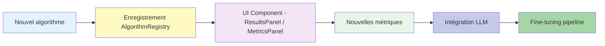


# Developer Guides

## 🎯 Objectif

Cette section fournit des **tutoriels pratiques** pour étendre AlgorithmLab :

- Créer de nouveaux algorithmes
- Ajouter des composants UI spécifiques
- Étendre les métriques d’évaluation
- Intégrer des LLM (GPT, Claude)
- Mettre en place un pipeline de fine-tuning

---

## 📚 Tutoriels disponibles

1. **[Ajouter un nouvel algorithme](add-new-algorithm.md)**→ Implémenter une classe conforme à `UniversalAlgorithm`, l’enregistrer et la tester.
2. **[Créer un composant UI](create-ui-component.md)**→ Étendre `ResultsPanel`, ajouter des colonnes et métriques personnalisées, intégrer des visualisations.
3. **[Étendre les métriques](extend-metrics.md)**→ Ajouter Macro/Weighted F1, MAPE, intervalles de confiance, métriques métier.
4. **[Intégrer un LLM](integrate-llm.md)**→ Créer un classificateur LLM sécurisé, gérer prompts et coûts, utiliser API Next.js.
5. **[Pipeline de fine-tuning](fine-tuning-pipeline.md)**
   → Extraire les erreurs, générer JSONL, analyser patterns, lancer fine-tuning OpenAI/Anthropic.

---

## 🏗️ Workflow développeur

