# H2 - Intégration des résultats Level 1

## 🎯 Objectif

Le **Level 2 (H2)** doit **réutiliser** les résultats des algorithmes du **Level 1** (M1, M2, M3) pour valider l'hypothèse H2 par corrélations et tests statistiques.

---

## 📊 Algorithmes Level 1 disponibles

### Variable M1 : Densité verbes d'action

**Localisation** : `algorithms/level1/M1Algorithms/`

**Algorithmes disponibles** :

* ✅ `M1ActionVerbCounter` : Compteur basé sur tokens
* ✅ `RegexM1Calculator` : Variantes de règles

**Input** :

```typescript
interface M1Input {
  text: string; // Verbatim du tour conseiller
}
```

**Output** :

```typescript
interface M1Output {
  density: number;           // Densité verbes [0-1]
  verbsFound: string[];      // Liste verbes détectés
  totalWords: number;        // Nb mots total
  actionVerbsCount: number;  // Nb verbes d'action
}
```

**Résultats attendus H2** :

* **ENGAGEMENT** : ~48,5% verbes 1ère personne ("je vérifie")
* **OUVERTURE** : ~19,1% verbes 2ème personne ("vous recevrez")
* **EXPLICATION** : ~9,0% verbes (auxiliaires/modaux)

---

### Variable M2 : Alignement linguistique

**Localisation** : `algorithms/level1/M2Algorithms/`

**Algorithmes disponibles** :

* ✅ `M2LexicalAlignmentCalculator` : Comparaison lexicale
* ✅ `M2SemanticAlignmentCalculator` : Alignement sémantique
* ✅ `M2CompositeAlignmentCalculator` : Combinaison pondérée

**Input** :

```typescript
interface M2Input {
  conseillerText: string;
  clientText: string;
}
```

**Output** :

```typescript
interface M2Output {
  lexicalAlignment: number;    // Score [0-1]
  semanticAlignment: number;   // Score [0-1]
  pragmaticAlignment?: number; // Score [0-1]
  globalAlignment: number;     // Score composite [0-1]
  details: {
    sharedTokens: string[];
    cohesionScore: number;
  };
}
```

**Résultats attendus H2** :

* **ENGAGEMENT** : ~34,2% reprise lexicale
* **OUVERTURE** : ~41,7% reprise lexicale
* **EXPLICATION** : ~12,4% reprise lexicale

---

### Variable M3 : Charge cognitive

**Localisation** : `algorithms/level1/M3Algorithms/`

**Algorithmes disponibles** :

* ✅ `PausesM3Calculator` : Durée des pauses
* 🚧 `HesitationM3Analyzer` : Marqueurs "euh", "ben", "alors" (à vérifier)
* 🚧 `LatencyM3Analyzer` : Temps de traitement (à vérifier)

**Input** :

```typescript
interface M3Input {
  text: string;         // Verbatim tour client
  startTime: number;    // Timestamp début (ms)
  endTime: number;      // Timestamp fin (ms)
  previousEndTime: number; // Timestamp fin tour précédent
}
```

**Output** :

```typescript
interface M3Output {
  hesitationMarkers: string[];  // ["euh", "ben"]
  hesitationCount: number;
  latencyMs: number;            // Temps réponse
  clarificationRequests: string[]; // ["comment ça ?"]
  cognitiveLoad: 'LOW' | 'MEDIUM' | 'HIGH';
}
```

**Résultats attendus H2** :

* **Réactions à ENGAGEMENT/OUVERTURE** :
  * Hésitations : <10%
  * Latence : <400ms (traitement automatique)
  * Clarifications : <5%
* **Réactions à EXPLICATION** :
  * Hésitations : >30%
  * Latence : >800ms (traitement coûteux)
  * Clarifications : >25%

---

## 🔄 Architecture d'intégration

### Flux de données Level 1 → Level 2

```mermaid
graph TB
    subgraph "📥 DONNÉES BRUTES"
        PAIRS[TurnPairs<br/>conseiller → client]
    end
  
    subgraph "🧪 LEVEL 1 ALGORITHMS"
        M1[M1ActionVerbCounter<br/>Densité verbes]
        M2[M2AlignmentCalculators<br/>Alignement 3 niveaux]
        M3[M3CognitiveAnalyzers<br/>Charge cognitive]
    end
  
    subgraph "📦 AGGREGATION"
        AGG[Level1ResultsAggregator<br/>Collecte résultats]
    end
  
    subgraph "📊 LEVEL 2 ANALYSIS"
        CORR[H2Correlator<br/>Corrélations]
        STATS[Statistical Tests<br/>ANOVA, t-tests, Chi²]
        VAL[H2 Validation<br/>Hypothèses H2.1-H2.4]
    end
  
    subgraph "🖥️ UI LEVEL 2"
        VIZ[H2AlignmentValidation<br/>Visualisations]
    end
  
    PAIRS --> M1
    PAIRS --> M2
    PAIRS --> M3
  
    M1 --> AGG
    M2 --> AGG
    M3 --> AGG
  
    AGG --> CORR
    CORR --> STATS
    STATS --> VAL
  
    VAL --> VIZ
  
    style PAIRS fill:#e3f2fd
    style AGG fill:#fff9c4
    style VAL fill:#e8f5e9
```



---

## 🛠️ Implémentation Level1ResultsAggregator

### Classe principale

```typescript
// components/Level2/shared/Level1ResultsAggregator.ts

import { algorithmRegistry } from '@/algorithms/level1/shared/AlgorithmRegistry';
import type { TurnPair, Level1Results } from '@/types/core/level2';

export class Level1ResultsAggregator {
  /**
   * Agrège les résultats M1, M2, M3 pour un ensemble de paires
   */
  async aggregateResults(turnPairs: TurnPair[]): Promise<Level1Results> {
    const m1Results = await this.runM1Analysis(turnPairs);
    const m2Results = await this.runM2Analysis(turnPairs);
    const m3Results = await this.runM3Analysis(turnPairs);
  
    return {
      m1Results,
      m2Results,
      m3Results,
      turnPairs
    };
  }
  
  /**
   * M1: Analyse densité verbes d'action sur tours conseiller
   */
  private async runM1Analysis(turnPairs: TurnPair[]) {
    const m1Algorithm = algorithmRegistry.get('M1ActionVerbCounter');
    if (!m1Algorithm) {
      throw new Error('M1ActionVerbCounter not found in registry');
    }
  
    const results = [];
  
    for (const pair of turnPairs) {
      const m1Result = await m1Algorithm.runUniversal({
        text: pair.conseillerTurn.verbatim
      });
    
      results.push({
        turnId: pair.conseillerTurn.id,
        verbDensity: m1Result.prediction, // Densité normalisée
        actionVerbs: m1Result.details?.verbsFound || [],
        totalWords: m1Result.details?.totalWords || 0,
        actionVerbsCount: m1Result.details?.actionVerbsCount || 0,
        strategy: pair.strategyTag
      });
    }
  
    return results;
  }
  
  /**
   * M2: Analyse alignement linguistique entre paires
   */
  private async runM2Analysis(turnPairs: TurnPair[]) {
    const m2Algorithm = algorithmRegistry.get('M2CompositeAlignmentCalculator');
    if (!m2Algorithm) {
      throw new Error('M2CompositeAlignmentCalculator not found in registry');
    }
  
    const results = [];
  
    for (const pair of turnPairs) {
      const m2Result = await m2Algorithm.runUniversal({
        conseillerText: pair.conseillerTurn.verbatim,
        clientText: pair.clientTurn.verbatim
      });
    
      results.push({
        pairId: `${pair.conseillerTurn.id}-${pair.clientTurn.id}`,
        lexicalAlignment: m2Result.details?.lexicalAlignment || 0,
        semanticAlignment: m2Result.details?.semanticAlignment || 0,
        pragmaticAlignment: m2Result.details?.pragmaticAlignment || 0,
        globalAlignment: m2Result.prediction, // Score composite
        strategy: pair.strategyTag
      });
    }
  
    return results;
  }
  
  /**
   * M3: Analyse charge cognitive sur tours client
   */
  private async runM3Analysis(turnPairs: TurnPair[]) {
    const m3Algorithm = algorithmRegistry.get('PausesM3Calculator');
    if (!m3Algorithm) {
      throw new Error('M3 algorithm not found in registry');
    }
  
    const results = [];
  
    for (const pair of turnPairs) {
      // Calcul latence
      const latencyMs = pair.clientTurn.startTime - pair.conseillerTurn.endTime;
    
      // Détection marqueurs hésitation (regex simple)
      const hesitationPattern = /(euh|ben|alors|hein|voilà)/gi;
      const hesitationMatches = pair.clientTurn.verbatim.match(hesitationPattern) || [];
    
      // Détection demandes clarification
      const clarificationPattern = /(comment|quoi|pardon|c'est-à-dire|je ne comprends)/gi;
      const clarificationMatches = pair.clientTurn.verbatim.match(clarificationPattern) || [];
    
      // Détermination charge cognitive
      let cognitiveLoad: 'LOW' | 'MEDIUM' | 'HIGH' = 'LOW';
      if (latencyMs > 800 || hesitationMatches.length > 2 || clarificationMatches.length > 0) {
        cognitiveLoad = 'HIGH';
      } else if (latencyMs > 400 || hesitationMatches.length > 0) {
        cognitiveLoad = 'MEDIUM';
      }
    
      results.push({
        turnId: pair.clientTurn.id,
        hesitationMarkers: hesitationMatches.length,
        clarificationRequests: clarificationMatches.length,
        latencyMs,
        cognitiveLoad,
        reactionTo: pair.strategyTag
      });
    }
  
    return results;
  }
}
```

---

## 📊 Implémentation H2Correlator

### Classe de corrélation

```typescript
// components/Level2/hypothesis/H2Correlator.ts

import type { Level1Results, H2Correlations, TurnPair } from '@/types/core/level2';

export class H2Correlator {
  /**
   * Calcule toutes les corrélations H2
   */
  async analyzeH2Correlations(
    results: Level1Results
  ): Promise<H2Correlations> {
    const verbsCorrelation = this.correlateVerbsWithReactions(
      results.m1Results,
      results.turnPairs
    );
  
    const alignmentCorrelation = this.correlateAlignmentWithReactions(
      results.m2Results,
      results.turnPairs
    );
  
    const cognitiveCorrelation = this.correlateCognitiveLoadWithReactions(
      results.m3Results,
      results.turnPairs
    );
  
    return {
      verbsCorrelation,
      alignmentCorrelation,
      cognitiveCorrelation
    };
  }
  
  /**
   * H2 Corrélation 1: Densité verbes → CLIENT_POSITIF
   */
  private correlateVerbsWithReactions(
    m1Results: Level1Results['m1Results'],
    turnPairs: TurnPair[]
  ) {
    // Données pour corrélation Pearson
    const data: Array<{ verbDensity: number; isPositive: number }> = [];
  
    for (const m1Result of m1Results) {
      const pair = turnPairs.find(p => p.conseillerTurn.id === m1Result.turnId);
      if (!pair) continue;
    
      data.push({
        verbDensity: m1Result.verbDensity,
        isPositive: pair.reactionTag === 'CLIENT_POSITIF' ? 1 : 0
      });
    }
  
    // Calcul corrélation Pearson
    const pearsonResult = this.calculatePearsonCorrelation(
      data.map(d => d.verbDensity),
      data.map(d => d.isPositive)
    );
  
    // Densité moyenne par stratégie
    const byStrategy = new Map<string, number>();
    for (const strategy of ['ENGAGEMENT', 'OUVERTURE', 'EXPLICATION']) {
      const strategyResults = m1Results.filter(r => r.strategy === strategy);
      const avgDensity = strategyResults.reduce((sum, r) => sum + r.verbDensity, 0) / 
                        strategyResults.length;
      byStrategy.set(strategy, avgDensity);
    }
  
    return {
      pearsonR: pearsonResult.r,
      pValue: pearsonResult.pValue,
      significative: pearsonResult.pValue < 0.05,
      byStrategy
    };
  }
  
  /**
   * H2 Corrélation 2: Alignement → CLIENT_POSITIF
   */
  private correlateAlignmentWithReactions(
    m2Results: Level1Results['m2Results'],
    turnPairs: TurnPair[]
  ) {
    const data: Array<{ alignment: number; isPositive: number }> = [];
  
    for (const m2Result of m2Results) {
      const pair = turnPairs.find(p => 
        `${p.conseillerTurn.id}-${p.clientTurn.id}` === m2Result.pairId
      );
      if (!pair) continue;
    
      data.push({
        alignment: m2Result.globalAlignment,
        isPositive: pair.reactionTag === 'CLIENT_POSITIF' ? 1 : 0
      });
    }
  
    const pearsonResult = this.calculatePearsonCorrelation(
      data.map(d => d.alignment),
      data.map(d => d.isPositive)
    );
  
    // Alignement moyen par stratégie
    const byStrategy = new Map<string, number>();
    for (const strategy of ['ENGAGEMENT', 'OUVERTURE', 'EXPLICATION']) {
      const strategyResults = m2Results.filter(r => r.strategy === strategy);
      const avgAlignment = strategyResults.reduce((sum, r) => sum + r.globalAlignment, 0) / 
                          strategyResults.length;
      byStrategy.set(strategy, avgAlignment);
    }
  
    return {
      pearsonR: pearsonResult.r,
      pValue: pearsonResult.pValue,
      significative: pearsonResult.pValue < 0.05,
      byStrategy
    };
  }
  
  /**
   * H2 Corrélation 3: Charge cognitive → CLIENT_NEGATIF
   */
  private correlateCognitiveLoadWithReactions(
    m3Results: Level1Results['m3Results'],
    turnPairs: TurnPair[]
  ) {
    const data: Array<{ cognitiveLoad: number; isNegative: number }> = [];
  
    for (const m3Result of m3Results) {
      const pair = turnPairs.find(p => p.clientTurn.id === m3Result.turnId);
      if (!pair) continue;
    
      // Encodage charge cognitive numériquement
      const loadValue = m3Result.cognitiveLoad === 'HIGH' ? 3 : 
                       m3Result.cognitiveLoad === 'MEDIUM' ? 2 : 1;
    
      data.push({
        cognitiveLoad: loadValue,
        isNegative: pair.reactionTag === 'CLIENT_NEGATIF' ? 1 : 0
      });
    }
  
    const pearsonResult = this.calculatePearsonCorrelation(
      data.map(d => d.cognitiveLoad),
      data.map(d => d.isNegative)
    );
  
    // Charge moyenne par stratégie
    const byStrategy = new Map<string, number>();
    for (const strategy of ['ENGAGEMENT', 'OUVERTURE', 'EXPLICATION']) {
      const strategyResults = m3Results.filter(r => r.reactionTo === strategy);
      const avgLoad = strategyResults.reduce((sum, r) => {
        const val = r.cognitiveLoad === 'HIGH' ? 3 : r.cognitiveLoad === 'MEDIUM' ? 2 : 1;
        return sum + val;
      }, 0) / strategyResults.length;
      byStrategy.set(strategy, avgLoad);
    }
  
    return {
      pearsonR: pearsonResult.r,
      pValue: pearsonResult.pValue,
      significative: pearsonResult.pValue < 0.05,
      byStrategy
    };
  }
  
  /**
   * Calcul corrélation de Pearson
   */
  private calculatePearsonCorrelation(
    x: number[],
    y: number[]
  ): { r: number; pValue: number } {
    const n = x.length;
  
    // Moyennes
    const meanX = x.reduce((a, b) => a + b, 0) / n;
    const meanY = y.reduce((a, b) => a + b, 0) / n;
  
    // Covariance et écarts-types
    let covariance = 0;
    let varianceX = 0;
    let varianceY = 0;
  
    for (let i = 0; i < n; i++) {
      const dx = x[i] - meanX;
      const dy = y[i] - meanY;
      covariance += dx * dy;
      varianceX += dx * dx;
      varianceY += dy * dy;
    }
  
    const r = covariance / Math.sqrt(varianceX * varianceY);
  
    // Test de significativité (approximation)
    const t = r * Math.sqrt(n - 2) / Math.sqrt(1 - r * r);
    const pValue = this.tTestPValue(t, n - 2);
  
    return { r, pValue };
  }
  
  /**
   * Calcul p-value pour t-test (approximation)
   */
  private tTestPValue(t: number, df: number): number {
    // Approximation simplifiée
    // En production, utiliser une bibliothèque statistique
    const absT = Math.abs(t);
    if (absT > 3) return 0.001;
    if (absT > 2.576) return 0.01;
    if (absT > 1.96) return 0.05;
    return 0.1;
  }
}
```

---

## 📈 Tests statistiques H2

### Classe de tests

```typescript
// components/Level2/shared/H2StatisticalTests.ts

import type { Level1Results, H2Correlations, H2StatisticalTests } from '@/types/core/level2';

export class H2StatisticalAnalyzer {
  /**
   * Exécute tous les tests statistiques H2
   */
  runStatisticalTests(
    results: Level1Results,
    correlations: H2Correlations
  ): H2StatisticalTests {
    return {
      anovaAlignment: this.anovaAlignmentByStrategy(results.m2Results),
      tTestLatency: this.tTestLatencyByStrategy(results.m3Results),
      chiSquareCognitive: this.chiSquareCognitiveMarkers(results.m3Results),
      pearsonTests: {
        verbsVsPositive: {
          r: correlations.verbsCorrelation.pearsonR,
          pValue: correlations.verbsCorrelation.pValue,
          ci95: this.calculateCI95(correlations.verbsCorrelation.pearsonR, results.turnPairs.length),
          significative: correlations.verbsCorrelation.significative
        },
        alignmentVsPositive: {
          r: correlations.alignmentCorrelation.pearsonR,
          pValue: correlations.alignmentCorrelation.pValue,
          ci95: this.calculateCI95(correlations.alignmentCorrelation.pearsonR, results.turnPairs.length),
          significative: correlations.alignmentCorrelation.significative
        },
        cognitiveVsNegative: {
          r: correlations.cognitiveCorrelation.pearsonR,
          pValue: correlations.cognitiveCorrelation.pValue,
          ci95: this.calculateCI95(correlations.cognitiveCorrelation.pearsonR, results.turnPairs.length),
          significative: correlations.cognitiveCorrelation.significative
        }
      }
    };
  }
  
  /**
   * ANOVA: Alignement par stratégie
   * H0: Pas de différence d'alignement entre stratégies
   */
  private anovaAlignmentByStrategy(m2Results: Level1Results['m2Results']) {
    // Grouper par stratégie
    const groups = new Map<string, number[]>();
    for (const result of m2Results) {
      if (!groups.has(result.strategy)) {
        groups.set(result.strategy, []);
      }
      groups.get(result.strategy)!.push(result.globalAlignment);
    }
  
    // Calcul ANOVA
    const allValues = m2Results.map(r => r.globalAlignment);
    const grandMean = allValues.reduce((a, b) => a + b, 0) / allValues.length;
  
    let ssBetween = 0;
    let ssWithin = 0;
  
    for (const [strategy, values] of groups) {
      const groupMean = values.reduce((a, b) => a + b, 0) / values.length;
      ssBetween += values.length * Math.pow(groupMean - grandMean, 2);
    
      for (const value of values) {
        ssWithin += Math.pow(value - groupMean, 2);
      }
    }
  
    const dfBetween = groups.size - 1;
    const dfWithin = allValues.length - groups.size;
  
    const msBetween = ssBetween / dfBetween;
    const msWithin = ssWithin / dfWithin;
  
    const fStatistic = msBetween / msWithin;
    const pValue = this.fTestPValue(fStatistic, dfBetween, dfWithin);
  
    // Statistiques par groupe
    const groupStats = Array.from(groups.entries()).map(([strategy, values]) => ({
      strategy,
      mean: values.reduce((a, b) => a + b, 0) / values.length,
      std: Math.sqrt(values.reduce((sum, v) => sum + Math.pow(v - (values.reduce((a, b) => a + b, 0) / values.length), 2), 0) / values.length),
      n: values.length
    }));
  
    return {
      fStatistic,
      pValue,
      significative: pValue < 0.05,
      groups: groupStats
    };
  }
  
  /**
   * t-test: Latences ACTIONS vs EXPLICATIONS
   * H0: Pas de différence de latence
   */
  private tTestLatencyByStrategy(m3Results: Level1Results['m3Results']) {
    const actions = m3Results.filter(r => 
      r.reactionTo === 'ENGAGEMENT' || r.reactionTo === 'OUVERTURE'
    ).map(r => r.latencyMs);
  
    const explanations = m3Results.filter(r => 
      r.reactionTo === 'EXPLICATION'
    ).map(r => r.latencyMs);
  
    const meanActions = actions.reduce((a, b) => a + b, 0) / actions.length;
    const meanExplanations = explanations.reduce((a, b) => a + b, 0) / explanations.length;
  
    const varActions = actions.reduce((sum, v) => sum + Math.pow(v - meanActions, 2), 0) / (actions.length - 1);
    const varExplanations = explanations.reduce((sum, v) => sum + Math.pow(v - meanExplanations, 2), 0) / (explanations.length - 1);
  
    const pooledVar = ((actions.length - 1) * varActions + (explanations.length - 1) * varExplanations) / 
                      (actions.length + explanations.length - 2);
  
    const se = Math.sqrt(pooledVar * (1/actions.length + 1/explanations.length));
    const tStatistic = (meanActions - meanExplanations) / se;
    const df = actions.length + explanations.length - 2;
    const pValue = this.tTestPValue(tStatistic, df);
  
    return {
      tStatistic,
      pValue,
      significative: pValue < 0.05,
      meanActions,
      meanExplanations,
      difference: meanActions - meanExplanations
    };
  }
  
  /**
   * Chi²: Marqueurs cognitifs par stratégie
   * H0: Pas d'association entre stratégie et marqueurs
   */
  private chiSquareCognitiveMarkers(m3Results: Level1Results['m3Results']) {
    // Table de contingence: stratégie × présence marqueurs
    const strategies = ['ENGAGEMENT', 'OUVERTURE', 'EXPLICATION'];
    const contingencyTable: number[][] = [];
  
    for (const strategy of strategies) {
      const withMarkers = m3Results.filter(r => 
        r.reactionTo === strategy && (r.hesitationMarkers > 0 || r.clarificationRequests > 0)
      ).length;
    
      const withoutMarkers = m3Results.filter(r => 
        r.reactionTo === strategy && r.hesitationMarkers === 0 && r.clarificationRequests === 0
      ).length;
    
      contingencyTable.push([withMarkers, withoutMarkers]);
    }
  
    // Calcul Chi²
    const totals = {
      row: contingencyTable.map(row => row.reduce((a, b) => a + b, 0)),
      col: [0, 0]
    };
  
    for (let j = 0; j < 2; j++) {
      for (let i = 0; i < strategies.length; i++) {
        totals.col[j] += contingencyTable[i][j];
      }
    }
  
    const grandTotal = totals.row.reduce((a, b) => a + b, 0);
  
    let chiSquare = 0;
    for (let i = 0; i < strategies.length; i++) {
      for (let j = 0; j < 2; j++) {
        const expected = (totals.row[i] * totals.col[j]) / grandTotal;
        const observed = contingencyTable[i][j];
        chiSquare += Math.pow(observed - expected, 2) / expected;
      }
    }
  
    const df = (strategies.length - 1) * (2 - 1);
    const pValue = this.chiSquarePValue(chiSquare, df);
  
    return {
      chiSquare,
      pValue,
      significative: pValue < 0.05,
      contingencyTable
    };
  }
  
  /**
   * Calcul intervalle de confiance 95% pour corrélation
   */
  private calculateCI95(r: number, n: number): [number, number] {
    // Transformation de Fisher
    const z = 0.5 * Math.log((1 + r) / (1 - r));
    const se = 1 / Math.sqrt(n - 3);
    const zLower = z - 1.96 * se;
    const zUpper = z + 1.96 * se;
  
    // Transformation inverse
    const rLower = (Math.exp(2 * zLower) - 1) / (Math.exp(2 * zLower) + 1);
    const rUpper = (Math.exp(2 * zUpper) - 1) / (Math.exp(2 * zUpper) + 1);
  
    return [rLower, rUpper];
  }
  
  // Fonctions auxiliaires pour p-values (simplifiées)
  private tTestPValue(t: number, df: number): number {
    const absT = Math.abs(t);
    if (absT > 3) return 0.001;
    if (absT > 2.576) return 0.01;
    if (absT > 1.96) return 0.05;
    return 0.1;
  }
  
  private fTestPValue(f: number, df1: number, df2: number): number {
    if (f > 10) return 0.001;
    if (f > 5) return 0.01;
    if (f > 3) return 0.05;
    return 0.1;
  }
  
  private chiSquarePValue(chi: number, df: number): number {
    if (chi > 10.83) return 0.001;
    if (chi > 5.99) return 0.05;
    return 0.1;
  }
}
```

---

## ✅ Checklist de validation

### Avant de commencer l'implémentation

* [ ] **Vérifier disponibilité algorithmes Level 1**
  * [ ] M1ActionVerbCounter dans AlgorithmRegistry
  * [ ] M2CompositeAlignmentCalculator dans AlgorithmRegistry
  * [ ] PausesM3Calculator (ou équivalent) dans AlgorithmRegistry
* [ ] **Comprendre format données**
  * [ ] Structure TurnPair (conseiller + client + métadonnées)
  * [ ] Tags stratégies (ENGAGEMENT, OUVERTURE, EXPLICATION)
  * [ ] Tags réactions (CLIENT_POSITIF, CLIENT_NEGATIF, CLIENT_NEUTRE)
* [ ] **Préparer corpus de test**
  * [ ] ~300 paires minimum pour robustesse statistique
  * [ ] Distribution équilibrée des stratégies
  * [ ] Annotations gold standard disponibles

### Validation progressive

**Phase 1: Agrégation**

* [ ] Level1ResultsAggregator récupère bien M1/M2/M3
* [ ] Résultats cohérents avec attendus thèse
* [ ] Pas d'erreurs sur corpus test

**Phase 2: Corrélations**

* [ ] Corrélations Pearson calculées correctement
* [ ] Significativité testée (p < 0.05)
* [ ] Résultats par stratégie cohérents

**Phase 3: Tests statistiques**

* [ ] ANOVA alignement significative
* [ ] t-test latences significatif
* [ ] Chi² marqueurs cognitifs significatif

**Phase 4: Validation H2**

* [ ] H2.1 validée (alignement multidimensionnel)
* [ ] H2.2 validée (convergence temporelle)
* [ ] H2.3 validée (charge cognitive inversée)
* [ ] H2.4 validée (corrélations croisées)

---

## 📚 Ressources et questions

### Questions à clarifier

1. **Algorithmes M3** : Quels algorithmes exacts sont disponibles pour charge cognitive au Level 1 ?
2. **Format données** : Comment récupérer les TurnPairs depuis Supabase ?
3. **Gold standard** : Où sont stockées les annotations expertes pour validation ?
4. **Tests existants** : Y a-t-il des tests unitaires Level 1 à examiner ?

### Prochaines étapes suggérées

1. **Audit algorithmes Level 1** : Lister tous les algorithmes disponibles
2. **Mock data** : Créer données test pour développement
3. **Implémentation Phase 1** : Level1ResultsAggregator
4. **Tests unitaires** : Validation agrégation sur données test

---

*Document créé le 2025-10-01*
*AlgorithmLab Level 2 - Intégration résultats Level 1*
