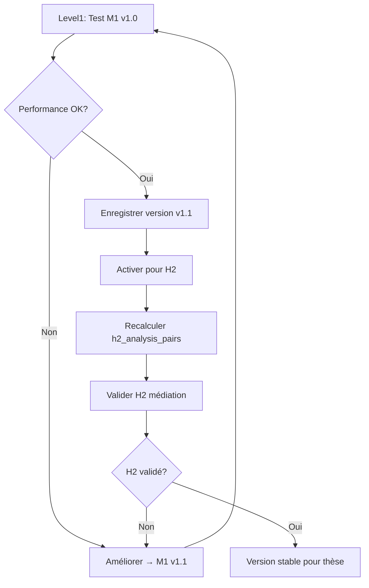

## Pourquoi Versioning dès Level1 ?

### 1. **Traçabilité des Expérimentations**

typescript

```typescript
// Sans versioning Level1 → CHAOS
Jour1:"M1 marche bien, accuracy 87%"
Jour3:"M1 moins bon maintenant, accuracy 73%"
❓ Question:Qu'est-ce qui a changé exactement ?
→ Impossible à savoir sans versioning !

// Avec versioning Level1 → CLARTÉ
v1.0:RegexM1Calculator(baseline) → 73%
v1.1:RegexM1Calculator+ contexte → 87%
v1.2:HybridM1Calculator(regex+LLM) → 91%
✅ On sait exactement quelle version utiliser pour H2
```

### 2. **Reproductibilité H2**

sql

```sql
-- Mauvaise approche: h2_analysis_pairs SANS version
UPDATE h2_analysis_pairs 
SET m1_verb_density = calculate_m1(verbatim)
-- ❌ Quel algorithme ? Quels params ? Version ?

-- Bonne approche: h2_analysis_pairs AVEC version
UPDATE h2_analysis_pairs 
SET 
  m1_verb_density = calculate_m1_v1_2(verbatim),
  algorithm_version ='v1.2_hybrid',
  computation_timestamp =NOW()
WHERE algorithm_version ISNULLOR algorithm_version !='v1.2_hybrid'
-- ✅ Traçabilité totale
```

## Solution Recommandée : Versioning Léger dans AlgorithmRegistry

### Architecture Proposée

typescript

```typescript
// 📁 algorithms/level1/shared/AlgorithmRegistry.ts

interfaceAlgorithmVersion{
  key:string;// "RegexM1Calculator"
  version:string;// "1.2.0"
  displayName:string;// "M1 Regex Enhanced"
  target:VariableTarget;// "M1"
  
// Infos versioning
  changelog?:string;// "Ajout détection verbes composés"
  deprecated?:boolean;// true si obsolète
  replaces?:string;// "1.1.0" (version précédente)
  
// Config sérialisable pour H2
  config?:{
    contextWindow?:number;
    weightFactors?:Record<string,number>;
    thresholds?:Record<string,number>;
};
}

classAlgorithmRegistry{
private algorithms =newMap<string,AlgorithmVersion>();
  
// Enregistrer avec version
register(algo:AlgorithmVersion){
const fullKey =`${algo.key}@${algo.version}`;
this.algorithms.set(fullKey, algo);
  
// Alias "latest" pour faciliter l'usage
this.algorithms.set(algo.key, algo);
}
  
// Récupérer version spécifique
get(key:string, version?:string):AlgorithmVersion|undefined{
if(version){
returnthis.algorithms.get(`${key}@${version}`);
}
returnthis.algorithms.get(key);// retourne latest
}
  
// Lister toutes les versions d'un algo
getVersions(key:string):AlgorithmVersion[]{
returnArray.from(this.algorithms.values())
.filter(a => a.key=== key)
.sort((a, b)=>compareVersions(b.version, a.version));
}
}
```

### Enregistrement dans Level1

typescript

```typescript
// 📁 algorithms/level1/m1/index.ts

exportconstregisterM1Algorithms=()=>{
// Version 1.0 (baseline)
  algorithmRegistry.register({
    key:"RegexM1Calculator",
    version:"1.0.0",
    displayName:"M1 Regex Baseline",
    target:"M1",
    config:{
      contextWindow:0,
      weightActionVerbs:1.0
}
});
  
// Version 1.1 (amélioration)
  algorithmRegistry.register({
    key:"RegexM1Calculator",
    version:"1.1.0",
    displayName:"M1 Regex + Context",
    target:"M1",
    replaces:"1.0.0",
    changelog:"Ajout fenêtre contexte ±2 tours",
    config:{
      contextWindow:2,
      weightActionVerbs:1.5
}
});
  
// Version 1.2 (hybride)
  algorithmRegistry.register({
    key:"HybridM1Calculator",
    version:"1.2.0",
    displayName:"M1 Hybrid (Regex + LLM)",
    target:"M1",
    replaces:"RegexM1Calculator@1.1.0",
    changelog:"Validation LLM pour cas ambigus",
    config:{
      contextWindow:2,
      weightActionVerbs:1.5,
      llmFallbackThreshold:0.3
}
});
};
```

### UI Level1 avec Sélecteur de Version

typescript

```typescript
// 📁 components/Level1/algorithms/M1Calculators/M1ValidationInterface.tsx

exportdefaultfunctionM1ValidationInterface(){
const[selectedVersion, setSelectedVersion]=useState<string>("latest");
  
const versions = algorithmRegistry.getVersions("RegexM1Calculator");
  
return(
<Box>
{/* Sélecteur de version */}
<FormControl sx={{ mb:2, minWidth:300}}>
<InputLabel>VersionAlgorithme</InputLabel>
<Select
          value={selectedVersion}
          onChange={(e)=>setSelectedVersion(e.target.value)}
>
<MenuItem value="latest">
<Stack direction="row" spacing={1}>
<Chip label="Latest" size="small" color="success"/>
<Typography>Version courante</Typography>
</Stack>
</MenuItem>
        
{versions.map(v =>(
<MenuItem key={v.version} value={v.version}>
<Stack direction="row" spacing={1} alignItems="center">
<Chip 
                  label={`v${v.version}`} 
                  size="small" 
                  variant={v.deprecated?"outlined":"filled"}
/>
<Typography>{v.displayName}</Typography>
{v.changelog&&(
<Tooltip title={v.changelog}>
<InfoIcon fontSize="small"/>
</Tooltip>
)}
</Stack>
</MenuItem>
))}
</Select>
</FormControl>
    
{/* Interface de test */}
<BaseAlgorithmTesting
        variableLabel="M1 — Densité de verbes d'action"
        defaultClassifier={`RegexM1Calculator@${selectedVersion}`}
        target="M1"
/>
</Box>
);
}
```

### Propagation vers Level2/H2

typescript

```typescript
// 📁 services/h2DataRefresh.ts

asyncfunctionrefreshH2WithVersion(versionId:string){
// 1. Récupérer la config de la version
const algoConfig =await db.query(`
    SELECT m1_algorithm_config, m2_algorithm_config, m3_algorithm_config
    FROM algorithm_version_registry
    WHERE version_id = $1
`,[versionId]);
  
// 2. Recalculer h2_analysis_pairs avec cette config
await db.query(`
    UPDATE h2_analysis_pairs
    SET 
      m1_verb_density = calculate_m1_with_config($1, conseiller_verbatim),
      m2_global_alignment = calculate_m2_with_config($2, conseiller_verbatim, client_verbatim),
      m3_cognitive_score = calculate_m3_with_config($3, client_verbatim),
      algorithm_version = $4,
      computed_at = NOW()
    WHERE computation_status = 'pending'
`,[
    algoConfig.m1_algorithm_config,
    algoConfig.m2_algorithm_config,
    algoConfig.m3_algorithm_config,
    versionId
]);
}
```

## Schéma BDD Minimal

sql

```sql
-- Table légère de métadonnées versions
CREATETABLE algorithm_versions (
    version_id VARCHAR(50)PRIMARYKEY,
    created_at TIMESTAMPDEFAULTNOW(),
  
-- Infos algorithmes
    m1_key VARCHAR(100),
    m1_version VARCHAR(20),
    m1_config JSONB,
  
    m2_key VARCHAR(100),
    m2_version VARCHAR(20),
    m2_config JSONB,
  
    m3_key VARCHAR(100),
    m3_version VARCHAR(20),
    m3_config JSONB,
  
-- État
    is_active BOOLEANDEFAULTFALSE,
    deprecated BOOLEANDEFAULTFALSE,
  
-- Méta
    description TEXT,
    changelog TEXT
);

-- h2_analysis_pairs référence la version
ALTERTABLE h2_analysis_pairs 
ADDCOLUMN algorithm_version VARCHAR(50) 
REFERENCES algorithm_versions(version_id);

CREATEINDEX idx_h2_version ON h2_analysis_pairs(algorithm_version);
```

## Workflow Complet

mermaid



## Avantages de cette Approche

✅ **Simple** : Pas de système complexe, juste des métadonnées

✅ **Traçable** : Chaque version est identifiable

✅ **Reproductible** : On peut re-run Level2 avec n'importe quelle version

✅ **Flexible** : Facile d'ajouter de nouvelles versions

✅ **Compatible** : S'intègre dans votre architecture existante

## Recommandation Finale

 **Oui, intégrez le versioning dès Level1** , mais :

* Gardez-le **léger** (pas de Git-like branching)
* Utilisez votre `AlgorithmRegistry` existant
* Ajoutez juste 2 colonnes à votre BDD (`algorithm_version` dans `h2_analysis_pairs` + table `algorithm_versions`)
* Exposez le sélecteur de version dans l'UI Level1

Cela vous permettra de **tester plusieurs variantes d'algorithmes en Level1** et de **choisir la meilleure version pour Level2/H2** en toute confiance, avec traçabilité complète pour votre thèse.

Voulez-vous que je vous montre l'implémentation complète du versioning dans votre `AlgorithmRegistry` actuel ?
