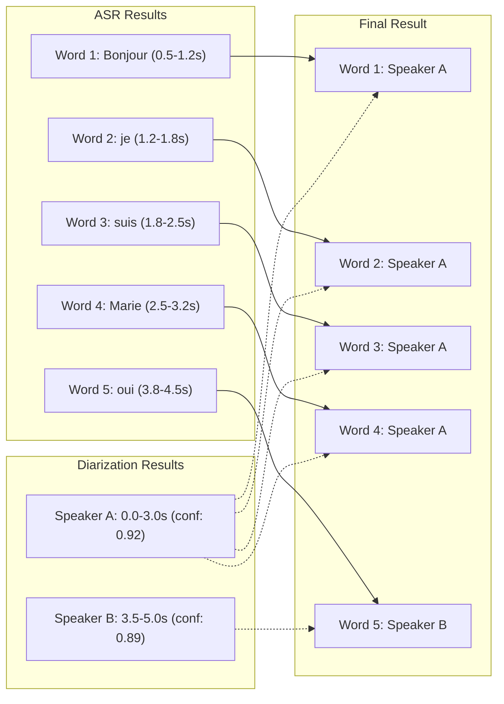

# 🎙️ Architecture de Transcription & Diarisation

> Architecture DDD rationalisée pour la transcription automatique avec segmentation et diarisation

## 📋 Table des Matières

- [Vue d&#39;ensemble](https://claude.ai/chat/cbd80c4e-8905-4710-bef4-536cde9675a3#vue-densemble)
- [Architecture Globale](https://claude.ai/chat/cbd80c4e-8905-4710-bef4-536cde9675a3#architecture-globale)
- [Flow Chart Détaillé](https://claude.ai/chat/cbd80c4e-8905-4710-bef4-536cde9675a3#flow-chart-d%C3%A9taill%C3%A9)
- [Composants Principaux](https://claude.ai/chat/cbd80c4e-8905-4710-bef4-536cde9675a3#composants-principaux)
- [API Routes](https://claude.ai/chat/cbd80c4e-8905-4710-bef4-536cde9675a3#api-routes)
- [Services Domain](https://claude.ai/chat/cbd80c4e-8905-4710-bef4-536cde9675a3#services-domain)
- [Flux de Données](https://claude.ai/chat/cbd80c4e-8905-4710-bef4-536cde9675a3#flux-de-donn%C3%A9es)
- [Exemples d&#39;Usage](https://claude.ai/chat/cbd80c4e-8905-4710-bef4-536cde9675a3#exemples-dusage)
- [Migration depuis l&#39;Ancienne Architecture](https://claude.ai/chat/cbd80c4e-8905-4710-bef4-536cde9675a3#migration)

## 🎯 Vue d'ensemble

Cette architecture moderne remplace l'ancien système hybride par une approche **Domain-Driven Design** pure avec :

- ✅ **API Routes directes** vers OpenAI/AssemblyAI
- ✅ **Segments temporels** pour synchronisation ASR ↔ Diarisation
- ✅ **Services Domain** avec logique métier isolée
- ✅ **Gestion d'erreurs** granulaire par stage
- ✅ **Sécurité** avec clés API côté serveur uniquement

## 🏗️ Architecture Globale

```mermaid
graph TD
    UI[Interface Utilisateur] --> DS[Domain Services]
    DS --> AC[API Clients]
    AC --> TR[/api/calls/transcribe]
    AC --> DR[/api/calls/diarize]
    TR --> OpenAI[OpenAI API]
    DR --> AssemblyAI[AssemblyAI API]
```

### Architecture en Couches

````
┌─────────────────────────────────────┐
│           CLIENT (Browser)          │
│  ┌─────────────────────────────┐    │
│  │ Interface Utilisateur       │    │
│  └─────────────────────────────┘    │
│  ┌─────────────────────────────┐    │
│  │ Domain Services            │    │
│  │ - TranscriptionASRService   │    │
│  │ - TranscriptionIntegration  │    │
│  │ - DiarizationService        │    │
│  └─────────────────────────────┘    │
│  ┌─────────────────────────────┐    │
│  │ API Clients                 │    │
│  │ - TranscriptionApiClient    │    │
│  │ - DiarizationApiClient      │    │
│  └─────────────────────────────┘    │
└─────────────────────────────────────┘
                  ↓ HTTP
┌─────────────────────────────────────┐
│           SERVER (Next.js)          │
│  ┌─────────────────────────────┐    │
│  │ API Routes                  │    │
│  │ - /api/calls/transcribe     │    │
│  │ - /api/calls/diarize        │    │
│  └─────────────────────────────┘    │
└─────────────────────────────────────┘
                  ↓ HTTPS# 🎙️ Architecture de Transcription & Diarisation

> Architecture DDD rationalisée pour la transcription automatique avec segmentation et diarisation

## 📋 Table des Matières

- [Vue d'ensemble](#vue-densemble)
- [Architecture Globale](#architecture-globale)
- [Flow Chart Détaillé](#flow-chart-détaillé)
- [Composants Principaux](#composants-principaux)
- [API Routes](#api-routes)
- [Services Domain](#services-domain)
- [Flux de Données](#flux-de-données)
- [Exemples d'Usage](#exemples-dusage)
- [Migration depuis l'Ancienne Architecture](#migration)

## 🎯 Vue d'ensemble

Cette architecture moderne remplace l'ancien système hybride par une approche **Domain-Driven Design** pure avec :

- ✅ **API Routes directes** vers OpenAI/AssemblyAI
- ✅ **Segments temporels** pour synchronisation ASR ↔ Diarisation
- ✅ **Services Domain** avec logique métier isolée
- ✅ **Gestion d'erreurs** granulaire par stage
- ✅ **Sécurité** avec clés API côté serveur uniquement

## 🏗️ Architecture Globale

```mermaid
graph TD
    subgraph CLIENT["CLIENT (Browser)"]
        UI[Interface Utilisateur]
        DS[Domain Services]
        AC[API Clients]
    end

    subgraph SERVER["SERVER (Next.js)"]
        TR[/api/calls/transcribe]
        DR[/api/calls/diarize]
        OAPI[OpenAI SDK]
        AAPI[AssemblyAI SDK]
    end

    subgraph EXTERNAL["EXTERNAL SERVICES"]
        OpenAI[OpenAI API]
        AssemblyAI[AssemblyAI API]
    end

    UI --> DS
    DS --> AC
    AC --> TR
    AC --> DR
    TR --> OAPI
    DR --> AAPI
    OAPI --> OpenAI
    AAPI --> AssemblyAI
````

## 🔄 Flow Chart Détaillé

### Flux Complet de Transcription

```mermaid
flowchart TD
    Start([Démarrage]) --> GetCall[Récupération Call]
    GetCall --> CheckAudio{Audio disponible?}
    CheckAudio -->|Non| Error1[Erreur: Pas d'audio]
    CheckAudio -->|Oui| GenerateURL[Génération URL signée]

    GenerateURL --> ChooseMode{Mode de transcription?}

    ChooseMode -->|transcription-only| TranscriptionFlow[Flux Transcription]
    ChooseMode -->|diarization-only| DiarizationFlow[Flux Diarisation]
    ChooseMode -->|complete| CompleteFlow[Flux Complet]

    TranscriptionFlow --> CallWhisper[Appel OpenAI Whisper]
    CallWhisper --> ParseSegments[Extraction Segments + Mots]
    ParseSegments --> Normalize[Normalisation ASR]
    Normalize --> SaveTranscript[Sauvegarde]
    SaveTranscript --> EndTranscript([Fin Transcription])

    DiarizationFlow --> CheckExisting{Transcription existe?}
    CheckExisting -->|Non| Error2[Erreur: Pas de transcription]
    CheckExisting -->|Oui| CallAssembly[Appel AssemblyAI]
    CallAssembly --> ExtractSpeakers[Extraction Speakers]
    ExtractSpeakers --> AlignWords[Alignement Mots/Speakers]
    AlignWords --> SaveDiar[Sauvegarde]
    SaveDiar --> EndDiar([Fin Diarisation])

    CompleteFlow --> CallWhisperComp[Appel OpenAI]
    CallWhisperComp --> CallAssemblyComp[Appel AssemblyAI]
    CallAssemblyComp --> AlignComplete[Alignement Complet]
    AlignComplete --> ValidateAll[Validation]
    ValidateAll --> SaveComplete[Sauvegarde Complète]
    SaveComplete --> EndComplete([Fin Complète])

    Error1 --> EndError([Échec])
    Error2 --> EndError

    CallWhisper -->|Erreur| Retry1{Retry?}
    CallAssembly -->|Erreur| Retry2{Retry?}
    Retry1 -->|Oui| CallWhisper
    Retry1 -->|Non| EndError
    Retry2 -->|Oui| CallAssembly
    Retry2 -->|Non| EndError
```

### Flux d'Alignement ASR ↔ Diarisation



## 🧩 Composants Principaux

### 1. 🌐 API Routes (Infrastructure)

#### `/api/calls/transcribe`

```typescript
// Responsabilités :
// ✅ Appel direct OpenAI Whisper API
// ✅ Récupération segments + mots temporels
// ✅ Gestion erreurs OpenAI (auth, quota, timeout)
// ✅ Health checks

POST /api/calls/transcribe
{
  "fileUrl": "https://storage.com/audio.wav",
  "options": {
    "model": "whisper-1",
    "language": "fr",
    "temperature": 0,
    "prompt": "Centre de contact, service client"
  }
}

Response:
{
  "success": true,
  "result": {
    "task": "transcribe",
    "language": "fr",
    "duration": 125.4,
    "text": "Bonjour je suis Marie...",
    "segments": [...], // 🎯 Segments temporels structurés
    "words": [...]     // 🎯 Mots avec timestamps
  },
  "metrics": {
    "processingTimeMs": 8420,
    "estimatedCost": 0.0075
  }
}
```

#### `/api/calls/diarize`

```typescript
// Responsabilités :
// ✅ Appel direct AssemblyAI API
// ✅ Extraction segments speakers
// ✅ Gestion erreurs AssemblyAI
// ✅ Health checks

POST /api/calls/diarize
{
  "fileUrl": "https://storage.com/audio.wav",
  "options": {
    "languageCode": "fr",
    "timeoutMs": 600000
  }
}

Response:
{
  "success": true,
  "result": [
    {
      "start": 0.0,
      "end": 12.5,
      "speaker": "SPEAKER_00",
      "confidence": 0.92
    },
    {
      "start": 12.8,
      "end": 25.3,
      "speaker": "SPEAKER_01",
      "confidence": 0.89
    }
  ]
}
```

### 2. 🎯 Domain Services (Logique Métier)

#### `TranscriptionASRService`

```typescript
// Responsabilités :
// ✅ Normalisation formats OpenAI → standard
// ✅ Segmentation intelligente pour diarisation
// ✅ Assignation tours de parole (mots ↔ speakers)
// ✅ Validation et métriques qualité
// ✅ Algorithmes d'alignement avancés

class TranscriptionASRService {
  // Entrée : Réponse brute OpenAI
  // Sortie : Format standardisé avec segments
  normalize(rawOpenAI: WhisperResponse): TranscriptionJson;

  // Assignation basique avec tolérance temporelle
  assignTurns(words: Word[], speakers: DiarizationSegment[]): Word[];

  // Assignation avancée avec gestion conflits
  assignTurnsOverlap(words, speakers, options): Word[];

  // Validation complète avec métriques
  validateAll(words: Word[]): ValidationResult;
}
```

#### `TranscriptionIntegrationService`

```typescript
// Responsabilités :
// ✅ Orchestration complète du workflow
// ✅ Gestion des modes (transcription/diarisation/complet)
// ✅ Appels coordonnés aux API routes
// ✅ Traitement en lot avec gestion concurrence
// ✅ Métriques et monitoring

class TranscriptionIntegrationService {
  // Workflow complet
  transcribeComplete(callId: string): Promise<TranscriptionJobResult>;

  // Workflows partiels
  transcribeOnly(callId: string): Promise<TranscriptionJobResult>;
  diarizeExisting(callId: string): Promise<TranscriptionJobResult>;

  // Traitement en lot
  transcribeBatch(
    callIds: string[],
    options
  ): Promise<BatchTranscriptionResult>;
}
```

#### `DiarizationService`

```typescript
// Responsabilités :
// ✅ Logique d'alignement mots ↔ speakers
// ✅ Preprocessing segments (fusion, validation)
// ✅ Résolution conflits et amélioration cohérence
// ✅ Analyse qualité diarisation
// ✅ Outils debugging et visualisation

class DiarizationService {
  // Méthode principale d'assignation
  assignTurnsToWords(words, diarizationSegments, options): Word[];

  // Analyse qualité avec recommandations
  analyzeDiarizationQuality(words, segments): QualityAnalysis;

  // Debug et visualisation
  generateTimelineVisualization(words, segments): string[];
}
```

### 3. 💻 API Clients (Transport HTTP)

#### `TranscriptionApiClient`

```typescript
// Responsabilités :
// ✅ Wrapper HTTP vers /api/calls/transcribe
// ✅ Gestion timeouts et retry côté client
// ✅ Parsing réponses et gestion erreurs réseau
// ✅ Health checks côté client

class TranscriptionApiClient {
  async transcribeAudio(fileUrl: string, options): Promise<WhisperResponse>;
  async healthCheck(): Promise<HealthStatus>;
}
```

## 📊 Flux de Données

### Formats d'Échange

#### 1. 📝 Word (Unité de Base)

```typescript
interface Word {
  text: string; // "Bonjour"
  startTime: number; // 0.5 (secondes)
  endTime: number; // 1.2 (secondes)
  turn?: string; // "SPEAKER_00" (après diarisation)
  type?: string; // "word" | "punctuation" | "hesitation"
}
```

#### 2. 📋 AsrSegment (Segment ASR)

```typescript
interface AsrSegment {
  id: string; // "seg_0001"
  start: number; // 0.5 (secondes)
  end: number; // 12.8 (secondes)
  text: string; // "Bonjour je suis Marie du service client"
  words: Word[]; // Mots contenus dans le segment
}
```

#### 3. 🎭 DiarizationSegment (Segment Speaker)

```typescript
interface DiarizationSegment {
  start: number; // 0.0 (secondes)
  end: number; // 12.5 (secondes)
  speaker: string; // "SPEAKER_00"
  confidence?: number; // 0.92 (0-1)
}
```

#### 4. 📄 TranscriptionJson (Format Final)

```typescript
interface TranscriptionJson {
  words: Word[]; // ✅ Mots avec tours assignés
  segments?: AsrSegment[]; // ✅ Segments ASR (nouveauté)
  meta?: {
    version: string; // "1.1"
    createdAt: string; // ISO timestamp
    source: "asr:auto";
    language: string; // "fr-FR"
    durationSec: number; // 125.4
    speakerCount?: number; // 2 (après diarisation)
    transcriptionProvider?: string; // "openai-whisper"
    diarizationProvider?: string; // "assemblyai"
  };
}
```

## 🚀 Exemples d'Usage

### Transcription Complète

```typescript
// 1. Initialisation du service
const integrationService = createTranscriptionIntegrationService(
  callRepository,
  storageRepository
);

// 2. Transcription complète (ASR + Diarisation + Alignement)
const result = await integrationService.transcribeComplete("call-123");

if (result.success) {
  console.log(`✅ Transcription réussie:`);
  console.log(`- Durée: ${result.metrics.audioDuration}s`);
  console.log(`- Mots: ${result.metrics.wordCount}`);
  console.log(`- Speakers: ${result.metrics.speakerCount}`);
  console.log(`- Coût: $${result.metrics.totalCost.toFixed(4)}`);

  // Accès aux mots avec tours
  result.transcription?.words.forEach((word) => {
    console.log(`${word.startTime}s: [${word.turn}] "${word.text}"`);
  });
} else {
  console.error(`❌ Échec: ${result.error}`);
}
```

### Traitement en Lot

```typescript
const batchResult = await integrationService.transcribeBatch(
  ["call-123", "call-456", "call-789"],
  {
    mode: "complete",
    maxConcurrent: 3,
    pauseBetweenBatches: 2000,
    onProgress: (completed, total, current) => {
      console.log(`📊 Progression: ${completed}/${total}`);
      if (current?.success) {
        console.log(`✅ ${current.callId}: ${current.metrics.wordCount} mots`);
      }
    },
  }
);

console.log(`🎉 Lot terminé:`);
console.log(`- Succès: ${batchResult.successfulJobs}/${batchResult.totalJobs}`);
console.log(`- Coût total: $${batchResult.totalCost.toFixed(4)}`);
console.log(
  `- Temps moyen: ${(batchResult.averageProcessingTime / 1000).toFixed(1)}s`
);
```

### Analyse de Qualité

```typescript
const diarizationService = new DiarizationService();

// Analyse de la qualité de diarisation
const quality = diarizationService.analyzeDiarizationQuality(
  transcription.words,
  diarizationSegments
);

console.log(`📊 Qualité: ${quality.quality}`);
if (quality.issues.length > 0) {
  console.log(`⚠️ Problèmes détectés:`);
  quality.issues.forEach((issue) => console.log(`  - ${issue}`));

  console.log(`💡 Recommandations:`);
  quality.recommendations.forEach((rec) => console.log(`  - ${rec}`));
}

// Visualisation timeline
const timeline = diarizationService.generateTimelineVisualization(
  transcription.words,
  diarizationSegments
);
timeline.forEach((line) => console.log(line));
```

## 🔄 Migration depuis l'Ancienne Architecture

### Avant (Problématique)

```typescript
// ❌ Ancien système - providers dans routes API
export async function POST(request: NextRequest) {
  // Provider intermédiaire inutile
  const provider = new OpenAIWhisperProvider(apiKey);
  const result = await provider.transcribeAudio(fileUrl);
  // Pas de segments structurés
  return { text: result.text }; // ← Un seul bloc de texte !
}
```

### Après (Clean)

```typescript
// ✅ Nouveau système - SDK direct + segments
export async function POST(request: NextRequest) {
  // SDK direct OpenAI
  const openai = new OpenAI({ apiKey: process.env.OPENAI_API_KEY });

  const result = await openai.audio.transcriptions.create({
    file: audioFile,
    response_format: "verbose_json",
    timestamp_granularities: ["word", "segment"], // ← Segments !
  });

  return {
    success: true,
    result: {
      text: result.text,
      segments: result.segments, // ← Segments temporels
      words: result.words, // ← Mots avec timestamps
    },
  };
}
```

### Checklist de Migration

- [ ] ✅ Supprimer `OpenAIWhisperProvider` et `AssemblyAIDiarizationProvider`
- [ ] ✅ Remplacer par appels directs SDK dans routes API
- [ ] ✅ Mettre à jour `TranscriptionASRService` pour gérer segments
- [ ] ✅ Adapter `TranscriptionIntegrationService` pour API routes
- [ ] ✅ Simplifier API Clients en wrappers légers
- [ ] ✅ Tester l'alignement ASR ↔ Diarisation avec segments
- [ ] ✅ Valider les métriques et coûts
- [ ] ✅ Monitoring et alertes

## 📈 Monitoring et Métriques

### Métriques Collectées

```typescript
interface TranscriptionMetrics {
  // Performance
  processingTime: number; // Temps total (ms)
  audioDuration: number; // Durée audio (s)

  // Qualité
  wordCount: number; // Nombre de mots
  speakerCount: number; // Nombre de locuteurs
  segmentCount: number; // Nombre de segments

  // Coûts
  whisperCost: number; // Coût OpenAI ($)
  assemblyAICost: number; // Coût AssemblyAI ($)
  totalCost: number; // Coût total ($)

  // Qualité Diarisation
  turnCoverage: number; // % mots avec speaker (0-100)
  averageConfidence: number; // Confidence moyenne (0-1)
}
```

### Health Checks

```typescript
// Vérification santé des services
const health = await callsApiClient.getServicesHealth()

// Résultat
{
  transcription: {
    status: "healthy",
    responseTime: 245,
    openaiStatus: "available"
  },
  diarization: {
    status: "healthy",
    responseTime: 189,
    assemblyaiStatus: "available"
  },
  overall: "healthy", // healthy | degraded | unhealthy
  lastChecked: "2024-01-15T10:30:00Z"
}
```

## 🎯 Roadmap & Améliorations

### Phase 1 - ✅ Terminée

- [x] Architecture DDD avec séparation clean
- [x] API Routes directes sans providers
- [x] Gestion segments ASR pour synchronisation
- [x] Algorithmes alignement avancés
- [x] Validation et métriques qualité

### Phase 2 - 🚧 En cours

- [ ] Métriques persistantes en base de données
- [ ] Dashboard monitoring temps réel
- [ ] API de batch processing asynchrone
- [ ] Cache intelligent multi-niveaux
- [ ] Webhooks pour notifications

### Phase 3 - 📋 Planifiée

- [ ] Support Azure OpenAI et autres providers
- [ ] Modèles Whisper locaux (auto-hébergés)
- [ ] ML Pipeline pour amélioration continue
- [ ] API GraphQL pour requêtes complexes
- [ ] Intégration Prometheus/Grafana

---

## 🤝 Contributing

Cette architecture respecte les principes **Domain-Driven Design** avec une séparation claire des responsabilités. Chaque modification doit préserver :

- **Domain purity** : Logique métier indépendante de l'infrastructure
- **API security** : Clés API protégées côté serveur uniquement
- **Performance** : Segments structurés pour synchronisation optimale
- **Observability** : Métriques et logs détaillés à chaque étape

---

**Statut** : ✅ Production Ready

**Version** : 2.0

**Dernière mise à jour** : Janvier 2025

<style>#mermaid-1758696502972{font-family:sans-serif;font-size:16px;fill:#333;}#mermaid-1758696502972 .error-icon{fill:#552222;}#mermaid-1758696502972 .error-text{fill:#552222;stroke:#552222;}#mermaid-1758696502972 .edge-thickness-normal{stroke-width:2px;}#mermaid-1758696502972 .edge-thickness-thick{stroke-width:3.5px;}#mermaid-1758696502972 .edge-pattern-solid{stroke-dasharray:0;}#mermaid-1758696502972 .edge-pattern-dashed{stroke-dasharray:3;}#mermaid-1758696502972 .edge-pattern-dotted{stroke-dasharray:2;}#mermaid-1758696502972 .marker{fill:#333333;}#mermaid-1758696502972 .marker.cross{stroke:#333333;}#mermaid-1758696502972 svg{font-family:sans-serif;font-size:16px;}#mermaid-1758696502972 .label{font-family:sans-serif;color:#333;}#mermaid-1758696502972 .label text{fill:#333;}#mermaid-1758696502972 .node rect,#mermaid-1758696502972 .node circle,#mermaid-1758696502972 .node ellipse,#mermaid-1758696502972 .node polygon,#mermaid-1758696502972 .node path{fill:#ECECFF;stroke:#9370DB;stroke-width:1px;}#mermaid-1758696502972 .node .label{text-align:center;}#mermaid-1758696502972 .node.clickable{cursor:pointer;}#mermaid-1758696502972 .arrowheadPath{fill:#333333;}#mermaid-1758696502972 .edgePath .path{stroke:#333333;stroke-width:1.5px;}#mermaid-1758696502972 .flowchart-link{stroke:#333333;fill:none;}#mermaid-1758696502972 .edgeLabel{background-color:#e8e8e8;text-align:center;}#mermaid-1758696502972 .edgeLabel rect{opacity:0.5;background-color:#e8e8e8;fill:#e8e8e8;}#mermaid-1758696502972 .cluster rect{fill:#ffffde;stroke:#aaaa33;stroke-width:1px;}#mermaid-1758696502972 .cluster text{fill:#333;}#mermaid-1758696502972 div.mermaidTooltip{position:absolute;text-align:center;max-width:200px;padding:2px;font-family:sans-serif;font-size:12px;background:hsl(80,100%,96.2745098039%);border:1px solid #aaaa33;border-radius:2px;pointer-events:none;z-index:100;}#mermaid-1758696502972:root{--mermaid-font-family:sans-serif;}#mermaid-1758696502972:root{--mermaid-alt-font-family:sans-serif;}#mermaid-1758696502972 flowchart{fill:apa;}</style>
