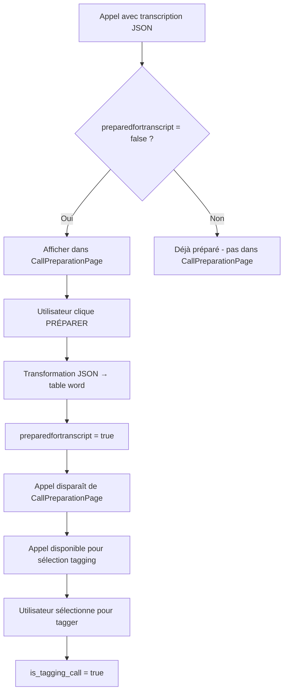

# 📋 **Correction - Fonctionnalités CallPreparationPage pour Architecture DDD**

## **Problème Identifié : Erreur d'Interprétation `is_tagging_call`**

### **Erreur dans le Document Original**

Le document suggérait de filtrer par `is_tagging_call = true` dans CallPreparationPage, ce qui est **conceptuellement incorrect** .

```typescript
// ❌ ERREUR - Ne pas faire cela dans CallPreparationPage
.eq("is_tagging_call", true) // Filtre incorrect
```

### **Correction Conceptuelle**

D'après l'analyse du code existant :

- **`is_tagging_call`** = État de **session utilisateur** (temporaire)
- **`preparedfortranscript`** = État de **préparation technique** (persistant)

**CallPreparationPage** doit préparer des appels **avant** qu'ils soient sélectionnés pour le tagging, donc **avant** qu'ils aient `is_tagging_call = true`.

---

## **Architecture Corrigée pour CallPreparationPage**

### **1. Critères de Filtrage Corrects**

```typescript
// ✅ CORRECTION : Filtres appropriés pour la préparation
const findPreparableCalls = async (): Promise<Call[]> => {
  const { data, error } = await supabase
    .from("call")
    .select("*")
    .eq("preparedfortranscript", false) // ✅ Appels non encore préparés
    .is("transcription", "not null") // ✅ Doit avoir une transcription
    .order("callid", { ascending: false });

  if (error)
    throw new RepositoryError(`Find preparable calls failed: ${error.message}`);
  return (data as DbCall[]).map(this.mapToCall);
};
```

### **2. Workflow de Préparation Correct**



### **3. Services DDD Corrigés**

#### **CallFilteringService Corrigé**

```typescript
export class CallFilteringService {
  /**
   * ✅ CORRECTION : Filtre pour les appels préparables
   * (non pas pour les appels en cours de tagging)
   */
  filterPreparableCalls(calls: Call[]): Call[] {
    return calls.filter(
      (call) =>
        call.hasValidTranscription() && // ✅ A une transcription
        !call.isReadyForTagging() && // ✅ Pas encore préparé
        call.status !== "archived" // ✅ Pas archivé
    );
  }

  /**
   * ✅ NOUVEAU : Filtre pour les appels en cours de tagging
   * (utilisé ailleurs, pas dans CallPreparationPage)
   */
  filterActiveTaggingCalls(calls: Call[]): Call[] {
    return calls.filter(
      (call) => call.isCurrentlyBeingTagged() // ✅ État de session tagging
    );
  }

  /**
   * ✅ CORRECTION : Filtre par statut conflictuel (était manquant)
   */
  filterByConflictStatus(calls: Call[], status: ConflictStatus): Call[] {
    switch (status) {
      case "conflictuel":
        return calls.filter((call) => call.status === "conflictuel");
      case "non_conflictuel":
        return calls.filter((call) => call.status === "non_conflictuel");
      case "non_supervisé":
        return calls.filter(
          (call) => call.status === "non_supervisé" || call.status === null
        );
      default:
        return calls;
    }
  }

  /**
   * ✅ CORRECTION : Groupement par origine (était manquant)
   */
  groupByOrigin(calls: Call[]): Record<string, Call[]> {
    return calls.reduce((acc, call) => {
      const origin = call.origin || "Aucune origine";
      if (!acc[origin]) acc[origin] = [];
      acc[origin].push(call);
      return acc;
    }, {} as Record<string, Call[]>);
  }
}
```

#### **Repository Corrigé**

```typescript
export class SupabaseCallRepository implements CallRepository {
  /**
   * ✅ CORRECTION : Requête pour CallPreparationPage
   */
  async findCallsForPreparation(): Promise<Call[]> {
    const { data, error } = await this.sb
      .from("call")
      .select("*")
      .eq("preparedfortranscript", false) // ✅ Non préparés
      .is("transcription", "not null") // ✅ Avec transcription
      .order("callid", { ascending: false });

    if (error)
      throw new RepositoryError(
        `Find preparation calls failed: ${error.message}`
      );
    return (data as DbCall[]).map(this.mapToCall);
  }

  /**
   * ✅ SÉPARÉ : Requête pour les appels en cours de tagging (autre contexte)
   */
  async findActiveTaggingCalls(): Promise<Call[]> {
    const { data, error } = await this.sb
      .from("call")
      .select("*")
      .eq("is_tagging_call", true) // ✅ Utilisé SEULEMENT ici
      .eq("preparedfortranscript", true) // ✅ Déjà préparés
      .order("callid", { ascending: false });

    if (error)
      throw new RepositoryError(
        `Find active tagging calls failed: ${error.message}`
      );
    return (data as DbCall[]).map(this.mapToCall);
  }
}
```

### **4. Interface CallPreparationPage Corrigée**

#### **Filtres Corrects**

```typescript
interface PreparationFilters {
  conflictStatus: "all" | "conflictuel" | "non_conflictuel" | "non_supervisé";
  origin: string | "all";
  hasAudio: boolean | "all";
  hasTranscription: boolean | "all";
  keyword: string;
}

// ✅ CORRECTION : Interface de filtres appropriée pour la préparation
const AdvancedFiltersForPreparation = () => {
  return (
    <>
      <FormControl size="small" sx={{ minWidth: 180 }}>
        <InputLabel>Type d'Appel</InputLabel>
        <Select value={filters.conflictStatus} onChange={handleStatusChange}>
          <MenuItem value="all">Tous les appels</MenuItem>
          <MenuItem value="conflictuel">🔴 Conflictuels</MenuItem>
          <MenuItem value="non_conflictuel">🟢 Non conflictuels</MenuItem>
          <MenuItem value="non_supervisé">⚪ Non supervisés</MenuItem>
        </Select>
      </FormControl>

      <FormControl size="small" sx={{ minWidth: 150 }}>
        <InputLabel>Origine</InputLabel>
        <Select value={filters.origin} onChange={handleOriginChange}>
          <MenuItem value="all">Toutes origines</MenuItem>
          {uniqueOrigins.map((origin) => (
            <MenuItem key={origin} value={origin}>
              {origin}
            </MenuItem>
          ))}
        </Select>
      </FormControl>
    </>
  );
};
```

#### **Logique de Préparation Corrigée**

```typescript
// ✅ CORRECTION : Service de préparation avec bonne logique
export class CallPreparationService {
  constructor(
    private callRepo: CallRepository,
    private transcriptionService: TranscriptionTransformationService
  ) {}

  async prepareCallForTagging(callId: string): Promise<PrepareResult> {
    // 1. ✅ Récupérer l'appel
    const call = await this.callRepo.findById(callId);
    if (!call) {
      throw new CallNotFoundError(callId);
    }

    // 2. ✅ Vérifier les prérequis AVANT préparation
    if (!call.hasValidTranscription()) {
      throw new ValidationError(["Appel sans transcription valide"]);
    }

    if (call.isReadyForTagging()) {
      throw new ValidationError(["Appel déjà préparé pour le tagging"]);
    }

    // 3. ✅ Transformer JSON → words (cœur de la préparation)
    await this.transcriptionService.transformJsonToWords(
      callId,
      call.transcription
    );

    // 4. ✅ Marquer comme préparé (pas comme en cours de tagging !)
    await this.callRepo.update(callId, {
      preparedfortranscript: true,
      // ✅ IMPORTANT : is_tagging_call reste false ici
      // Il sera mis à true seulement lors de la sélection utilisateur
    });

    return {
      success: true,
      callId,
      message: `Appel ${callId} préparé avec succès pour le tagging`,
    };
  }
}
```

---

## **Flux Complet Corrigé**

### **Phase 1 : CallPreparationPage (Préparation Technique)**

```typescript
// État initial de l'appel
{
  callid: "123",
  transcription: { words: [...] },     // ✅ JSON de transcription
  preparedfortranscript: false,        // ✅ Pas encore préparé
  is_tagging_call: false               // ✅ Pas en cours de tagging
}

// ↓ Utilisateur clique "PRÉPARER"
// ↓ Transformation JSON → table word
// ↓ État après préparation

{
  callid: "123",
  transcription: { words: [...] },     // ✅ JSON conservé
  preparedfortranscript: true,         // ✅ Maintenant préparé
  is_tagging_call: false               // ✅ Toujours false (pas encore sélectionné)
}
```

### **Phase 2 : Sélection pour Tagging (Interface NewTaggingPage)**

```typescript
// État après sélection utilisateur pour tagging
{
  callid: "123",
  transcription: { words: [...] },
  preparedfortranscript: true,         // ✅ Reste true
  is_tagging_call: true                // ✅ Maintenant true (session tagging)
}
```

---

## **Corrections Prioritaires à Implémenter**

### **1. Repository Calls (URGENT)**

```typescript
// ✅ AJOUTER : Méthode spécifique pour CallPreparationPage
async findCallsForPreparation(): Promise<Call[]> {
  // Filtre correct : non préparés avec transcription
}

// ✅ SÉPARER : Méthode pour interface tagging (autre contexte)
async findActiveTaggingCalls(): Promise<Call[]> {
  // Filtre : is_tagging_call = true (contexte différent)
}
```

### **2. CallPreparationService (URGENT)**

```typescript
// ✅ CORRIGER : Logique de préparation sans toucher is_tagging_call
async prepareCallForTagging(callId: string): Promise<void> {
  // Transformation JSON → words
  // preparedfortranscript = true
  // is_tagging_call reste inchangé
}
```

### **3. Interface CallPreparationPage (PRIORITÉ)**

```typescript
// ✅ AJOUTER : Filtres manquants
- Filtre par statut conflictuel
- Groupement par origine
- Tri et pagination

// ✅ CORRIGER : Critères d'affichage
- Afficher si preparedfortranscript = false
- Afficher si transcription existe
- NE PAS filtrer par is_tagging_call
```

### **4. TranscriptionTransformationService (NOUVEAU)**

```typescript
// ✅ CRÉER : Service dédié à la transformation
export class TranscriptionTransformationService {
  async transformJsonToWords(
    callId: string,
    transcriptionJson: any
  ): Promise<void>;
  async validateTranscriptionStructure(json: any): Promise<ValidationResult>;
}
```

---

## **Architecture Conceptuelle Finale**

```
📋 CallPreparationPage
├── Filtre: preparedfortranscript = false        ✅ ÉTAT TECHNIQUE
├── Filtre: transcription IS NOT NULL           ✅ PRÉREQUIS
├── Action: Transformer JSON → words            ✅ PRÉPARATION
└── Résultat: preparedfortranscript = true      ✅ PRÊT POUR SÉLECTION

🎯 NewTaggingPage / Sélection
├── Filtre: preparedfortranscript = true        ✅ APPELS PRÊTS
├── Action: Sélectionner pour tagging          ✅ CHOIX UTILISATEUR
└── Résultat: is_tagging_call = true           ✅ ÉTAT DE SESSION
```

Cette correction assure une séparation claire entre :

- **Préparation technique** (CallPreparationPage)
- **Sélection de session** (interfaces de tagging)

Le champ `is_tagging_call` reste dans son rôle de marqueur de session utilisateur, et `preparedfortranscript` garde son rôle d'état de préparation technique persistant.
