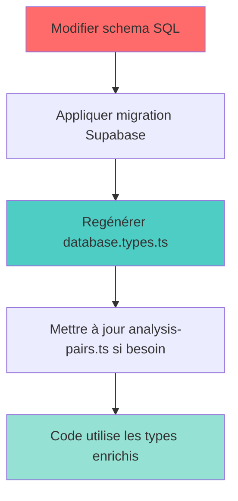

# AUDIT : Migration h2_analysis_pairs → analysis_pairs

**Date :** 18 novembre 2025

**Objectif :** Transformer `h2_analysis_pairs` en table centrale `analysis_pairs` pour tous les niveaux d'analyse

---

## 🎯 VISION CIBLE

### Nouvelle architecture

```
┌─────────────────────────────────────────────────────────┐
│           analysis_pairs (source de vérité)             │
├─────────────────────────────────────────────────────────┤
│                                                         │
│  📊 DONNÉES DE BASE (pour tous les niveaux)            │
│  ├─ pair_id (PK)                                       │
│  ├─ call_id, conseiller_turn_id, client_turn_id       │
│  ├─ strategy_tag, strategy_family, reaction_tag       │
│  ├─ conseiller_verbatim, client_verbatim              │
│  ├─ prev2_verbatim, prev1_verbatim                    │
│  ├─ next1_verbatim, next2_verbatim, next3_verbatim    │
│  └─ timestamps, speakers                               │
│                                                         │
│  🔬 RÉSULTATS LEVEL 0 (Gold Standard)                  │
│  ├─ level0_gold_conseiller (tag validé)               │
│  ├─ level0_gold_client (tag validé)                   │
│  └─ level0_annotator_agreement (kappa)                │
│                                                         │
│  🤖 RÉSULTATS LEVEL 1 - ALGORITHMES X/Y (H1)           │
│  ├─ x_predicted_tag (classification conseiller)       │
│  ├─ x_confidence                                       │
│  ├─ x_algorithm_version                               │
│  ├─ y_predicted_tag (classification client)           │
│  ├─ y_confidence                                       │
│  └─ y_algorithm_version                               │
│                                                         │
│  📈 RÉSULTATS LEVEL 2 - MÉDIATEURS (H2)                │
│  ├─ m1_verb_density, m1_verb_count                    │
│  ├─ m2_lexical_alignment, m2_semantic_alignment       │
│  ├─ m3_hesitation_count, m3_cognitive_score           │
│  └─ computation_status, computed_at                    │
│                                                         │
└─────────────────────────────────────────────────────────┘
         │              │              │
         ▼              ▼              ▼
    Level 0        Level 1        Level 2
  (Annotation)  (Validation)  (Hypothèses)
```

---

## 📁 MODULES À MODIFIER

### 1️⃣ BASE DE DONNÉES

#### 1.1 Fichiers SQL à modifier

| Fichier             | Action                                              | Priorité   |
| ------------------- | --------------------------------------------------- | ----------- |
| `doc/schema.sql`  | Renommer table + ajouter colonnes Level 0 & Level 1 | 🔴 CRITIQUE |
| Migrations Supabase | Créer script de migration                          | 🔴 CRITIQUE |

#### 1.2 Modifications de schéma

**Colonnes à ajouter :**

```sql
-- Level 0 : Gold Standard
ALTER TABLE analysis_pairs ADD COLUMN level0_gold_conseiller TEXT;
ALTER TABLE analysis_pairs ADD COLUMN level0_gold_client TEXT;
ALTER TABLE analysis_pairs ADD COLUMN level0_annotator_agreement NUMERIC;
ALTER TABLE analysis_pairs ADD COLUMN level0_validated_at TIMESTAMP;
ALTER TABLE analysis_pairs ADD COLUMN level0_validated_by TEXT;

-- Level 1 : Algorithmes X (conseiller)
ALTER TABLE analysis_pairs ADD COLUMN x_predicted_tag TEXT;
ALTER TABLE analysis_pairs ADD COLUMN x_confidence NUMERIC;
ALTER TABLE analysis_pairs ADD COLUMN x_algorithm_version TEXT;
ALTER TABLE analysis_pairs ADD COLUMN x_evidences JSONB;
ALTER TABLE analysis_pairs ADD COLUMN x_computed_at TIMESTAMP;

-- Level 1 : Algorithmes Y (client)
ALTER TABLE analysis_pairs ADD COLUMN y_predicted_tag TEXT;
ALTER TABLE analysis_pairs ADD COLUMN y_confidence NUMERIC;
ALTER TABLE analysis_pairs ADD COLUMN y_algorithm_version TEXT;
ALTER TABLE analysis_pairs ADD COLUMN y_evidences JSONB;
ALTER TABLE analysis_pairs ADD COLUMN y_computed_at TIMESTAMP;

-- Colonnes existantes à renommer
ALTER TABLE h2_analysis_pairs RENAME COLUMN next_turn_tag_auto TO y_predicted_tag_legacy;
ALTER TABLE h2_analysis_pairs RENAME COLUMN score_auto TO y_confidence_legacy;

-- Index pour performance
CREATE INDEX idx_analysis_pairs_x_predicted ON analysis_pairs(x_predicted_tag);
CREATE INDEX idx_analysis_pairs_y_predicted ON analysis_pairs(y_predicted_tag);
CREATE INDEX idx_analysis_pairs_level0_gold ON analysis_pairs(level0_gold_conseiller, level0_gold_client);
```

**Contraintes à ajouter :**

```sql
-- Validation des tags
ALTER TABLE analysis_pairs ADD CONSTRAINT chk_x_predicted_tag 
  CHECK (x_predicted_tag IN ('ENGAGEMENT', 'EXPLICATION', 'OUVERTURE', 'REFLET_ACQ', 'REFLET_JE', 'REFLET_VOUS'));

ALTER TABLE analysis_pairs ADD CONSTRAINT chk_y_predicted_tag 
  CHECK (y_predicted_tag IN ('CLIENT_POSITIF', 'CLIENT_NEUTRE', 'CLIENT_NEGATIF'));

-- Cohérence des versions
ALTER TABLE analysis_pairs ADD CONSTRAINT chk_version_format
  CHECK (x_algorithm_version ~ '^\d+[a-z]\d+[a-z]\d+$' OR x_algorithm_version IS NULL);
```

---

### 2️⃣ BACKEND - ALGORITHMES

#### 2.1 Algorithmes X (Classification Conseiller)

**Fichiers à modifier :**

| Fichier                           | Localisation               | Action                                     |
| --------------------------------- | -------------------------- | ------------------------------------------ |
| `RegexConseillerClassifier.ts`  | `algorithms/conseiller/` | Mettre à jour les métadonnées de sortie |
| `OpenAIConseillerClassifier.ts` | `algorithms/conseiller/` | Ajouter colonnes X dans metadata           |
| `SpacyConseillerClassifier.ts`  | `algorithms/conseiller/` | Idem                                       |

**Modifications requises :**

```typescript
// ❌ AVANT
return {
  prediction: classifiedTag,
  confidence: confidence,
  metadata: {
    target: 'conseiller',
    callId: input.callId,
    // ...
  }
};

// ✅ APRÈS
return {
  prediction: classifiedTag,
  confidence: confidence,
  metadata: {
    target: 'conseiller',
  
    // Pour mise à jour dans analysis_pairs
    x_predicted_tag: classifiedTag,
    x_confidence: confidence,
    x_algorithm_version: this.version,
    x_evidences: extractedEvidences,
    x_computed_at: new Date().toISOString(),
  
    // Métadonnées UI (inchangées)
    callId: input.callId,
    turnId: input.turnId,
    // ...
  }
};
```

#### 2.2 Algorithmes Y (Classification Client)

**Fichiers à modifier :**

| Fichier                      | Localisation                       | Action             |
| ---------------------------- | ---------------------------------- | ------------------ |
| `RegexClientClassifier.ts` | `algorithms/client/`             | Ajouter colonnes Y |
| `OpenAIXClassifier.ts`     | `algorithms/client/XAlgorithms/` | Idem               |
| `SpacyXClassifier.ts`      | `algorithms/client/XAlgorithms/` | Idem               |

**Même pattern que X :**

```typescript
metadata: {
  y_predicted_tag: predictedReaction,
  y_confidence: confidence,
  y_algorithm_version: this.version,
  y_evidences: detectedCues,
  y_computed_at: new Date().toISOString(),
}
```

#### 2.3 Algorithmes M1/M2/M3 (Médiateurs)

**Fichiers à modifier :**

| Fichier                              | Localisation                           | Action                                    |
| ------------------------------------ | -------------------------------------- | ----------------------------------------- |
| `M1ActionVerbCounter.ts`           | `algorithms/mediators/M1Algorithms/` | ✅ Déjà OK (écrit dans analysis_pairs) |
| `M2LexicalAlignmentCalculator.ts`  | `algorithms/mediators/M2Algorithms/` | ✅ Déjà OK                              |
| `M2SemanticAlignmentCalculator.ts` | `algorithms/mediators/M2Algorithms/` | ✅ Déjà OK                              |
| `PausesM3Calculator.ts`            | `algorithms/mediators/M3Algorithms/` | ✅ Déjà OK                              |

**⚠️ IMPORTANT : Corriger les noms de colonnes contexte**

```typescript
// ❌ AVANT (ligne 103)
prev2_turn_verbatim: (m2Input as any)?.prev2_turn_verbatim,
prev1_turn_verbatim: (m2Input as any)?.prev1_turn_verbatim,

// ✅ APRÈS
prev2_turn_verbatim: (m2Input as any)?.prev2_verbatim,
prev1_turn_verbatim: (m2Input as any)?.prev1_verbatim,
next_turn_verbatim: (m2Input as any)?.next1_verbatim,
```

---

### 3️⃣ BACKEND - HOOKS & DATA LOADING

#### 3.1 Hook useAnalysisPairs.ts (anciennement useH2data.ts)

**Fichier :** `src/features/phase3-analysis/level1-validation/ui/hooks/useAnalysisPairs.ts`

**Action :** Renommer le fichier + tous les imports + enrichir les types

```typescript
// ❌ AVANT
const { data, error } = await supabase
  .from('h2_analysis_pairs')
  .select('*');

// ✅ APRÈS
const { data, error } = await supabase
  .from('analysis_pairs')
  .select(`
    *,
    -- Jointures pour enrichissement si besoin
    conseiller_turn:turntagged!conseiller_turn_id(annotations),
    client_turn:turntagged!client_turn_id(annotations)
  `);
```

**Types à mettre à jour :**

```typescript
import { AnalysisPairRow, Level1Pair } from '@/types/analysis-pairs';

// Le hook retourne maintenant AnalysisPairRow au lieu de H2AnalysisPair
export function useAnalysisPairs() {
  const [analysisPairs, setAnalysisPairs] = useState<AnalysisPairRow[]>([]);
  const [loading, setLoading] = useState(false);
  
  const loadAnalysisPairs = async (filters?: AnalysisPairsFilters) => {
    // ...
  };
  
  return {
    analysisPairs,
    loadAnalysisPairs,
    refreshAnalysisPairs,
    loading
  };
}
```

#### 3.2 Hook useLevel1Testing.ts

**Fichier :** `src/features/phase3-analysis/level1-validation/ui/hooks/useLevel1Testing.ts`

**Action :** Mettre à jour les requêtes UPDATE avec les nouveaux noms de colonnes

```typescript
import { AnalysisPairUpdate } from '@/types/analysis-pairs';

// ❌ AVANT (lignes ~300-320)
const { error } = await supabase
  .from('h2_analysis_pairs')
  .update({
    next_turn_tag_auto: result.predicted,
    score_auto: result.confidence,
  })
  .eq('pair_id', pairId);

// ✅ APRÈS
const updateData: AnalysisPairUpdate = {};

if (algorithmName.includes('X')) {
  updateData.x_predicted_tag = result.predicted;
  updateData.x_confidence = result.confidence;
  updateData.x_algorithm_version = algorithmVersion;
  updateData.x_evidences = result.metadata?.evidences;
  updateData.x_computed_at = new Date().toISOString();
} else if (algorithmName.includes('Y')) {
  updateData.y_predicted_tag = result.predicted;
  updateData.y_confidence = result.confidence;
  updateData.y_algorithm_version = algorithmVersion;
  updateData.y_evidences = result.metadata?.evidences;
  updateData.y_computed_at = new Date().toISOString();
} else if (algorithmName.includes('M1')) {
  updateData.m1_verb_density = result.metadata?.m1_verb_density;
  updateData.m1_verb_count = result.metadata?.m1_verb_count;
  updateData.m1_total_words = result.metadata?.m1_total_words;
  updateData.m1_action_verbs = result.metadata?.m1_action_verbs;
} else if (algorithmName.includes('M2')) {
  updateData.m2_lexical_alignment = result.metadata?.m2_lexical_alignment;
  updateData.m2_semantic_alignment = result.metadata?.m2_semantic_alignment;
  updateData.m2_global_alignment = result.metadata?.m2_global_alignment;
  updateData.m2_shared_terms = result.metadata?.m2_shared_terms;
} else if (algorithmName.includes('M3')) {
  updateData.m3_hesitation_count = result.metadata?.m3_hesitation_count;
  updateData.m3_clarification_count = result.metadata?.m3_clarification_count;
  updateData.m3_cognitive_score = result.metadata?.m3_cognitive_score;
  updateData.m3_cognitive_load = result.metadata?.m3_cognitive_load;
  updateData.m3_patterns = result.metadata?.m3_patterns;
}

updateData.computation_status = 'computed';
updateData.computed_at = new Date().toISOString();

const { error } = await supabase
  .from('analysis_pairs')
  .update(updateData)
  .eq('pair_id', pairId);
```

---

### 4️⃣ FRONTEND - COMPOSANTS UI

#### 4.1 Level 0 - Gold Standard

**Fichiers :**

* `src/features/phase3-analysis/level0-gold/ui/components/InterAnnotatorAgreement.tsx`

**Action :**

```typescript
// Lire level0_gold_conseiller et level0_gold_client depuis analysis_pairs
// Calculer l'accord inter-annotateurs
// Mettre à jour level0_annotator_agreement
```

#### 4.2 Level 1 - AlgorithmLab

**Fichiers à modifier :**

| Composant                | Fichier                                                  | Action                             |
| ------------------------ | -------------------------------------------------------- | ---------------------------------- |
| `Level1Interface.tsx`  | `ui/components/AlgorithmLab/`                          | Lire depuis `analysis_pairs`     |
| `ResultsTableBody.tsx` | `ui/components/AlgorithmLab/ResultsSample/components/` | ✅ Corriger noms colonnes contexte |
| `MetricsPanel.tsx`     | `ui/components/AlgorithmLab/`                          | Afficher X et Y séparément       |

**Modifications ResultsTableBody.tsx :**

```typescript
// ✅ CORRECTION CONTEXTE (lignes 279-281)
const prev2 = m.prev2_verbatim as string | undefined;  // ✅ Bon nom !
const prev1 = m.prev1_verbatim as string | undefined;  // ✅ Bon nom !
const next1 = m.next1_verbatim as string | undefined;  // ✅ Bon nom (ou next_turn_verbatim)
```

#### 4.3 Level 2 - Hypotheses

**Fichiers :**

* `src/features/phase3-analysis/level2-hypotheses/ui/components/Level2Interface.tsx`

**Action :**

```typescript
// Lire les colonnes M1/M2/M3 depuis analysis_pairs (pas de changement majeur)
// Juste remplacer h2_analysis_pairs → analysis_pairs
```

---

### 5️⃣ TYPES TYPESCRIPT

Voir la section **📐 STRATÉGIE DE TYPES** ci-dessus pour la structure complète.

#### 5.1 Fichiers de types à créer/modifier

| Fichier                                    | Action                                                           | Priorité    |
| ------------------------------------------ | ---------------------------------------------------------------- | ------------ |
| `src/types/database.types.ts`            | Regénérer via Supabase CLI                                     | 🔴 CRITIQUE  |
| `src/types/analysis-pairs.ts`            | Créer avec types enrichis                                       | 🔴 CRITIQUE  |
| `src/types/algorithm-lab/Level1Types.ts` | Supprimer `H2AnalysisPair`, importer depuis `analysis-pairs` | 🟠 IMPORTANT |
| `src/types/algorithm-lab/SharedTypes.ts` | Ajouter exports pour compatibilité                              | 🟡 MOYEN     |

#### 5.2 Commandes de génération

```bash
# 1. Générer les types Supabase
npx supabase gen types typescript --local > src/types/database.types.ts

# 2. Vérifier la compilation TypeScript
npm run type-check
```

---

### 6️⃣ DOCUMENTATION

#### 6.1 Fichiers à mettre à jour

| Fichier                                     | Localisation                   | Action                                               |
| ------------------------------------------- | ------------------------------ | ---------------------------------------------------- |
| `README.md`                               | Racine du projet               | Mettre à jour architecture                          |
| `ALGORITHMLAB_DONNEES_ANALYSEES.MD`       | `doc/AlgorithmLab/old_docs/` | Renommer références                                |
| `level1_utilisation_h2_analysis_pairs.md` | `doc/level1/`                | Renommer en `level1_utilisation_analysis_pairs.md` |
| `doc_h2_analysis_pairs.md`                | `doc/level1/`                | Renommer en `doc_analysis_pairs.md`                |

#### 6.2 Nouvelle documentation à créer

**Fichier :** `doc/ARCHITECTURE_ANALYSIS_PAIRS.md`

```markdown
# Architecture : Table analysis_pairs

## Vue d'ensemble

`analysis_pairs` est la **source de vérité centrale** pour toutes les analyses conversationnelles dans TaggerLPL.

## Niveaux d'analyse supportés

### Level 0 : Gold Standard
- Annotation manuelle validée
- Accord inter-annotateurs

### Level 1 : Validation Algorithmique (H1)
- **Variable X** : Classification des stratégies conseiller
- **Variable Y** : Classification des réactions client

### Level 2 : Analyse de Médiation (H2)
- **M1** : Densité de verbes d'action
- **M2** : Alignement linguistique
- **M3** : Charge cognitive

## Flux de données

[Diagramme du flux...]
```

---

## 📊 IMPACT SUR L'ARCHITECTURE

### Avant (architecture actuelle)

```
Level 0 (Gold) ──────┐
                     │
Level 1 (H1) ────────┼──→ h2_analysis_pairs (table unique)
                     │
Level 2 (H2) ────────┘
```

**Problèmes :**

* ❌ Nom trompeur (`h2_` suggère que c'est uniquement pour Level 2)
* ❌ Level 1 "abuse" d'une table H2
* ❌ Pas de place pour Level 0

### Après (architecture cible)

```
                 ┌─────────────────────┐
                 │  analysis_pairs     │
                 │  (source de vérité) │
                 └──────────┬──────────┘
                            │
        ┌───────────────────┼───────────────────┐
        │                   │                   │
        ▼                   ▼                   ▼
  ┌─────────┐         ┌─────────┐        ┌──────────┐
  │ Level 0 │         │ Level 1 │        │ Level 2  │
  │  Gold   │         │   H1    │        │    H2    │
  │Standard │         │  X / Y  │        │ M1/M2/M3 │
  └─────────┘         └─────────┘        └──────────┘
```

**Avantages :**

* ✅ Architecture claire et logique
* ✅ Une seule source de vérité
* ✅ Évolutivité pour futurs niveaux
* ✅ Contexte conversationnel accessible partout

---

## 🔄 RENOMMAGES NÉCESSAIRES

### Fichiers à renommer

| Ancien nom                                  | Nouveau nom                              | Type          |
| ------------------------------------------- | ---------------------------------------- | ------------- |
| `useH2data.ts`                            | `useAnalysisPairs.ts`                  | Hook          |
| `doc_h2_analysis_pairs.md`                | `doc_analysis_pairs.md`                | Documentation |
| `level1_utilisation_h2_analysis_pairs.md` | `level1_utilisation_analysis_pairs.md` | Documentation |

### Imports à mettre à jour dans tout le code

```typescript
// ❌ AVANT
import { useH2data } from '@/hooks/useH2data';
const { h2Data, loadH2Data, refreshH2Data } = useH2data();

// ✅ APRÈS
import { useAnalysisPairs } from '@/hooks/useAnalysisPairs';
const { analysisPairs, loadAnalysisPairs, refreshAnalysisPairs } = useAnalysisPairs();
```

### Commande PowerShell pour trouver tous les fichiers à modifier

```powershell
# Trouver tous les imports de useH2data
Get-ChildItem -Recurse -Path "src" -Include *.ts,*.tsx | Select-String -Pattern "useH2data|h2Data" | Select-Object Path -Unique
```

---

## 📐 STRATÉGIE DE TYPES

### Approche hybride recommandée

Utiliser **les deux sources** de types avec des rôles distincts :

#### 1️⃣ Types de base : `database.types.ts` (AUTO-GÉNÉRÉ)

**Rôle :** Source de vérité absolue pour les types de la base de données

**Génération :**

```bash
npx supabase gen types typescript --local > src/types/database.types.ts
```

**Contenu :**

```typescript
export type Database = {
  public: {
    Tables: {
      analysis_pairs: {
        Row: {
          pair_id: number;
          call_id: number;
          strategy_tag: string;
          // ... tous les champs EXACTEMENT comme en DB
        };
        Insert: { /* champs requis pour INSERT */ };
        Update: { /* champs modifiables pour UPDATE */ };
      };
    };
  };
};
```

#### 2️⃣ Types métier enrichis : `analysis-pairs.ts` (MANUEL)

**Rôle :** Enrichissement et simplification pour l'usage métier

**Fichier :** `src/types/analysis-pairs.ts`

```typescript
import { Database } from './database.types';

// ========================================
// ALIASES POUR SIMPLIFIER
// ========================================
export type AnalysisPairRow = Database['public']['Tables']['analysis_pairs']['Row'];
export type AnalysisPairInsert = Database['public']['Tables']['analysis_pairs']['Insert'];
export type AnalysisPairUpdate = Database['public']['Tables']['analysis_pairs']['Update'];

// ========================================
// TYPES ENUM STRICTS
// ========================================
export type XStrategyTag = 
  | 'ENGAGEMENT' 
  | 'EXPLICATION' 
  | 'OUVERTURE' 
  | 'REFLET_ACQ' 
  | 'REFLET_JE' 
  | 'REFLET_VOUS';

export type YReactionTag = 
  | 'CLIENT_POSITIF' 
  | 'CLIENT_NEUTRE' 
  | 'CLIENT_NEGATIF';

export type ComputationStatus = 
  | 'pending'
  | 'computing'
  | 'computed'
  | 'error';

// ========================================
// INTERFACE MÉTIER ENRICHIE
// ========================================
/**
 * Interface métier enrichie pour analysis_pairs
 * Extend le type DB avec des champs calculés côté frontend
 */
export interface AnalysisPair extends AnalysisPairRow {
  // Champs calculés (préfixés par _ pour les distinguer)
  _contextQuality?: 'high' | 'medium' | 'low';
  _completenessPercent?: number;
  _hasFullContext?: boolean;
  _level1Complete?: boolean;
  _level2Complete?: boolean;
}

// ========================================
// TYPES DÉRIVÉS PAR NIVEAU
// ========================================

/**
 * Type pour Level 0 (Gold Standard)
 * Données nécessaires pour l'annotation manuelle
 */
export type Level0Pair = Pick<AnalysisPairRow, 
  'pair_id' | 
  'conseiller_verbatim' | 
  'client_verbatim' | 
  'prev2_verbatim' |
  'prev1_verbatim' |
  'next1_verbatim' |
  'level0_gold_conseiller' | 
  'level0_gold_client' |
  'level0_annotator_agreement' |
  'level0_validated_at'
>;

/**
 * Type pour Level 1 (Validation Algorithmique - H1)
 * Données nécessaires pour tester X et Y
 */
export type Level1Pair = Pick<AnalysisPairRow,
  'pair_id' | 
  'call_id' |
  'strategy_tag' | 
  'reaction_tag' | 
  'conseiller_verbatim' |
  'client_verbatim' |
  'x_predicted_tag' | 
  'x_confidence' | 
  'x_algorithm_version' |
  'x_evidences' |
  'y_predicted_tag' | 
  'y_confidence' | 
  'y_algorithm_version' |
  'y_evidences' |
  'prev2_verbatim' | 
  'prev1_verbatim' | 
  'next1_verbatim'
>;

/**
 * Type pour Level 2 (Hypothèses - H2)
 * Données nécessaires pour tester la médiation
 */
export type Level2Pair = Pick<AnalysisPairRow,
  'pair_id' | 
  'strategy_family' | 
  'reaction_tag' |
  'm1_verb_density' | 
  'm1_verb_count' |
  'm2_lexical_alignment' | 
  'm2_semantic_alignment' |
  'm3_cognitive_score' |
  'm3_cognitive_load' |
  'computation_status'
>;

// ========================================
// HELPERS DE VALIDATION
// ========================================

/**
 * Vérifie si une paire a un contexte complet
 */
export function hasFullContext(pair: AnalysisPairRow): boolean {
  return !!(pair.prev2_verbatim && pair.prev1_verbatim && pair.next1_verbatim);
}

/**
 * Calcule la complétude Level 1
 */
export function isLevel1Complete(pair: AnalysisPairRow): boolean {
  return !!(pair.x_predicted_tag && pair.y_predicted_tag);
}

/**
 * Calcule la complétude Level 2
 */
export function isLevel2Complete(pair: AnalysisPairRow): boolean {
  return !!(
    pair.m1_verb_density !== null &&
    pair.m2_lexical_alignment !== null &&
    pair.m3_cognitive_score !== null
  );
}
```

### Workflow de synchronisation



### Commandes de génération

```bash
# 1. Après modification du schéma SQL
npx supabase db reset --local

# 2. Générer les types TypeScript
npx supabase gen types typescript --local > src/types/database.types.ts

# 3. Vérifier que analysis-pairs.ts est toujours synchronisé
# (vérification manuelle des Pick<> et extends)
```

---

## 🎯 CHECKLIST DE MIGRATION

### Phase 1 : Préparation (SESSION 1 - ACTUELLE)

* [X] Audit complet des modules impactés
* [X] Définition du nouveau schéma de table
* [X] Définition de la stratégie de types
* [X] Identification des renommages nécessaires
* [ ] Validation de l'architecture cible avec équipe
* [ ] Génération des nouveaux types : `npx supabase gen types typescript`
* [ ] Création de `src/types/analysis-pairs.ts`

### Phase 2 : Migration Base de Données

* [ ] Script SQL de renommage de table
* [ ] Ajout des colonnes Level 0 et Level 1
* [ ] Création des index
* [ ] Migration des données existantes
* [ ] Tests de cohérence

### Phase 3 : Migration Backend

* [ ] Mise à jour des algorithmes X/Y
* [ ] Correction des algorithmes M1/M2/M3 (noms colonnes)
* [ ] Mise à jour des hooks (useH2data, useLevel1Testing)
* [ ] Tests unitaires

### Phase 4 : Migration Frontend

* [ ] Mise à jour des composants Level 0
* [ ] Mise à jour des composants Level 1
* [ ] Mise à jour des composants Level 2
* [ ] Correction de l'affichage du contexte
* [ ] Tests d'intégration

### Phase 5 : Documentation & Validation

* [ ] Mise à jour de la documentation
* [ ] Tests end-to-end
* [ ] Validation avec données réelles
* [ ] Déploiement

---

## ⚠️ RISQUES IDENTIFIÉS

| Risque                                              | Impact      | Mitigation                                   |
| --------------------------------------------------- | ----------- | -------------------------------------------- |
| **Perte de données pendant migration**       | 🔴 CRITIQUE | Backup complet + migration réversible       |
| **Régression des algorithmes M1/M2/M3**      | 🟠 MOYEN    | Tests unitaires avant/après                 |
| **Incompatibilité avec anciennes données**  | 🟠 MOYEN    | Script de migration progressive              |
| **Performance dégradée (table plus large)** | 🟡 FAIBLE   | Index optimisés + requêtes SELECT ciblées |
| **Confusion pendant la transition**           | 🟡 FAIBLE   | Documentation claire + communication         |

---

## 🚀 PROCHAINES ÉTAPES

1. **Valider cet audit** avec toi
2. **Créer le script de migration SQL** complet
3. **Tester en local** sur une copie de la base
4. **Migrer progressivement** module par module
5. **Déployer en production** après validation

---

## 📝 NOTES IMPORTANTES

### Compatibilité ascendante

Pour faciliter la migration, on peut garder une **vue de compatibilité** :

```sql
CREATE VIEW h2_analysis_pairs AS
SELECT 
  pair_id,
  call_id,
  strategy_tag,
  reaction_tag,
  -- Colonnes M1/M2/M3 (inchangées)
  m1_verb_density,
  m2_lexical_alignment,
  m3_cognitive_score,
  -- Mapping des nouvelles colonnes
  y_predicted_tag as next_turn_tag_auto,
  y_confidence as score_auto,
  -- Contexte
  prev2_verbatim,
  prev1_verbatim,
  next1_verbatim
FROM analysis_pairs;
```

Ainsi, **l'ancien code continue de fonctionner** pendant la transition !

---

## ❓ QUESTIONS EN SUSPENS

1. **Faut-il ajouter next2, next3, next4 verbatim ?**
   * La table `turntagged` a `prev4_turn_id`, `next4_turn_id`
   * Devrait-on avoir `next2_verbatim`, `next3_verbatim`, `next4_verbatim` ?
2. **Faut-il versionner les résultats ?**
   * Si on relance un algorithme, garder l'historique ?
   * Table séparée `analysis_pairs_history` ?
3. **Faut-il ajouter des métadonnées de fine-tuning ?**
   * `fine_tuning_version`, `fine_tuning_prompt`, etc. ?

---

**FIN DE L'AUDIT**

📌 **Ce document sera mis à jour au fur et à mesure de la migration.**
