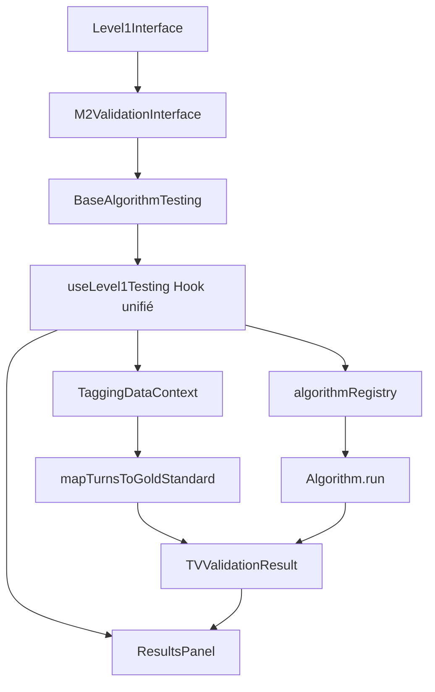

# 📊 Flux de données AlgorithmLab - Test d'algorithmes

> **Pattern unifié basé sur M1** (référence correcte)
>
> X/Y suivront ce même modèle après migration complète

## 🔄 Vue d'ensemble



## 📋 Étape par étape détaillée

### 1️⃣ **Interface utilisateur (Level1Interface)**

```typescript
// L'utilisateur sélectionne l'onglet M2
<Tabs value={variable} onChange={(_, v) => setVariable(v)}>
  <Tab label="M2 (Alignement X→Y)" value="M2" />
</Tabs>;

// Ceci monte le composant correspondant
{
  variable === "M2" && <M2ValidationInterface />;
}
```

### 2️⃣ **ValidationInterface (Pattern unifié)**

```typescript
// M2ValidationInterface utilise BaseAlgorithmTesting
return (
  <BaseAlgorithmTesting
    target="M2" // ← Détermine le filtre des données
    defaultAlgorithm="M2CompositeAlignment"
    onRun={(sampleSize) => {
      // Appelle useLevel1Testing.validateAlgorithm()
    }}
  />
);
```

### 3️⃣ **Hook unifié (useLevel1Testing)**

#### **A. Chargement des données réelles**

```typescript
const { allTurnTagged } = useTaggingData();

// Construction du gold standard unifié
const goldStandardData = useMemo(
  () => mapTurnsToGoldStandard(allTurnTagged, allowedConseiller),
  [allTurnTagged, allowedConseiller]
);
```

#### **B. Mapping unifié des données**

```typescript
// mapTurnsToGoldStandard crée des échantillons avec contexte complet
{
  verbatim: t.verbatim,                    // T0 (tour principal)
  expectedTag: normalizeLabel(t.tag),      // Gold standard
  metadata: {
    target: "conseiller",                  // Filtre par variable
    callId: t.call_id,
    turnId: t.id,

    // 🎯 CONTEXTE COMPLET (clé pour M2)
    prev2_turn_verbatim: p2?.verbatim,
    prev1_turn_verbatim: p1?.verbatim,
    current_turn_verbatim: t.verbatim,     // T0
    next_turn_verbatim: t.next_turn_verbatim, // T+1

    // Métadonnées pour bouton Annotations
    annotations: Array.isArray(t.annotations) ? t.annotations : [],

    // IDs pour navigation
    prev2_turn_id: p2?.id,
    prev1_turn_id: p1?.id,
    next_turn_id: nextTurn?.id,
  }
}
```

#### **C. Filtrage par target (automatique)**

```typescript
const validateAlgorithm = useCallback(async (classifierName, sampleSize) => {
  const classifier = algorithmRegistry.get(classifierName);
  const target = getClassificationTarget(classifierName); // "M2"

  // ✅ Filtre automatique selon l'algorithme sélectionné
  const base = goldStandardData.filter(s => s.metadata?.target === target);

  // Pour M2: filtre les échantillons conseiller avec next_turn_verbatim
  const m2Base = base.filter(s => s.metadata?.next_turn_verbatim);

  const samples = randomSample(m2Base, sampleSize);
```

#### **D. Préparation des inputs (spécifique M2)**

```typescript
// Pour M2, on construit l'objet { t0, t1, ... }
const inputs = samples.map((sample) => ({
  t0: sample.verbatim, // Tour conseiller
  t1: sample.metadata.next_turn_verbatim, // Tour client suivant
  prev1: sample.metadata.prev1_turn_verbatim, // Contexte T-1
  prev2: sample.metadata.prev2_turn_verbatim, // Contexte T-2

  // Métadonnées pour l'algorithme
  conseillerTurn: sample.verbatim,
  clientTurn: sample.metadata.next_turn_verbatim,
}));
```

#### **E. Exécution de l'algorithme**

```typescript
// Route unifiée pour tous les algorithmes
const results = await Promise.all(
  inputs.map(async (input, i) => {
    const sample = samples[i];

    // Appel unifié
    const prediction = await classifier.run(input);

    // Mapping vers format tableau unifié
    return {
      // ✅ CHAMPS OBLIGATOIRES pour ResultsTableBody
      verbatim: sample.verbatim, // Colonne principale
      predicted: prediction.prediction, // Sortie algorithme
      goldStandard: sample.expectedTag, // Tag manuel (ENGAGEMENT, etc.)
      confidence: prediction.confidence,
      processingTime: prediction.processingTime,
      correct: undefined, // M2 = pas de score correct/incorrect

      // ✅ MÉTADONNÉES OBLIGATOIRES pour contexte
      metadata: {
        ...sample.metadata, // Hérite du contexte complet

        // Infos algorithme pour header
        classifier: classifierName,
        type: "hybrid",

        // Résultats M2 spécifiques
        m2: {
          value: prediction.prediction, // ALIGNEMENT_FORT/FAIBLE/DESALIGNEMENT
          scale: "composite",
          lexicalScore: prediction.details?.lexicalAlignment,
          semanticScore: prediction.details?.semanticAlignment,
          overallScore: prediction.details?.overall,
          sharedTerms: prediction.details?.sharedTerms || [],
        },
      },
    };
  })
);
```

### 4️⃣ **Rendu des résultats (ResultsPanel)**

#### **A. Calcul automatique des métriques**

```typescript
// ResultsPanel détecte automatiquement le type de variable
const metricsType =
  targetKind === "M1" || targetKind === "M3" ? "numeric" : "classification";

// Pour M2: métriques de classification (distribution des alignements)
if (targetKind === "M2") {
  const distribution = {
    ALIGNEMENT_FORT: results.filter((r) => r.predicted === "ALIGNEMENT_FORT")
      .length,
    ALIGNEMENT_FAIBLE: results.filter(
      (r) => r.predicted === "ALIGNEMENT_FAIBLE"
    ).length,
    DESALIGNEMENT: results.filter((r) => r.predicted === "DESALIGNEMENT")
      .length,
  };
}
```

#### **B. Affichage du tableau unifié**

```typescript
// ResultsTableBody lit les champs standards pour toutes les variables
<TableRow>
  {/* Contexte conversationnel (4 lignes) */}
  <TableCell>
    T-2: {metadata.prev2_turn_verbatim || "—"}
    T-1: {metadata.prev1_turn_verbatim || "—"}
    T0: {verbatim} {/* ← Ligne principale */}
    T+1: {metadata.next_turn_verbatim || "—"}
  </TableCell>

  {/* Sortie algorithme */}
  <TableCell>{predicted}</TableCell>

  {/* Référence (tag manuel du conseiller) */}
  <TableCell>{goldStandard}</TableCell>

  {/* Colonnes communes */}
  <TableCell>{confidence}</TableCell>
  <TableCell>{processingTime}ms</TableCell>

  {/* Bouton Annotations */}
  <TableCell>
    <AnnotationList turnId={metadata.turnId} />
  </TableCell>

  {/* Colonnes spécifiques M2 */}
  {extraColumns.map((col) => (
    <TableCell key={col.id}>
      {col.render(result)} {/* Ex: metadata.m2.lexicalScore */}
    </TableCell>
  ))}
</TableRow>
```

## 🔧 Points techniques critiques

### **Registry unifié**

```typescript
// Tous les algorithmes sont enregistrés avec target
const M2CompositeAlignment = createUniversalAlgorithm(
  new M2CompositeAlignmentCalculator(),
  "M2", // ← target utilisé pour le filtrage
  { displayName: "M2 Composite Alignment" }
);

algorithmRegistry.register("M2CompositeAlignment", M2CompositeAlignment);
```

### **Détection automatique du target**

```typescript
const getClassificationTarget = (classifierName) => {
  const algo = algorithmRegistry.get(classifierName);
  const target = algo?.describe?.()?.target; // "M2"

  if (target === "M2") return "M2";
  // Retourne: "conseiller" | "client" | "M1" | "M2" | "M3"
};
```

### **Colonnes dynamiques par variable**

```typescript
// buildExtraColumnsForTarget("M2")
const extraColumns = [
  {
    id: "lexical",
    header: "Score lexical",
    render: (row) => row.metadata?.m2?.lexicalScore?.toFixed(2) || "—",
  },
  {
    id: "semantic",
    header: "Score sémantique",
    render: (row) => row.metadata?.m2?.semanticScore?.toFixed(2) || "—",
  },
  {
    id: "sharedTerms",
    header: "Termes partagés",
    render: (row) => row.metadata?.m2?.sharedTerms?.join(", ") || "—",
  },
];
```

## ✅ Avantages du pattern unifié

1. **Une seule source de données** : `TaggingDataContext`
2. **Un seul hook de test** : `useLevel1Testing`
3. **Un seul format de résultats** : `TVValidationResult`
4. **Une seule table** : `ResultsTableBody`
5. **Registry centralisé** : `algorithmRegistry`
6. **Filtrage automatique** : selon `algorithm.target`
7. **Contexte conversationnel automatique** : T-2/T-1/T0/T+1
8. **Métadonnées enrichies** : annotations, IDs, infos algorithme

## 🚨 Pattern à suivre pour M2

```typescript
// ❌ ÉVITER : Hook isolé avec données factices
const useM2AlgorithmTesting = () => {
  const seed = [
    /* données factices */
  ];
  // ...
};

// ✅ UTILISER : Hook unifié avec données réelles
const M2ValidationInterface = () => {
  const { validateAlgorithm } = useLevel1Testing();

  const runTest = useCallback(
    async (sampleSize) => {
      const results = await validateAlgorithm(
        "M2CompositeAlignment",
        sampleSize
      );
      // Les résultats sont automatiquement formatés pour la table
    },
    [validateAlgorithm]
  );
};
```

---

**🎯 Résultat** : M2 suit exactement le même flux que M1, avec des données réelles, un contexte conversationnel complet, et un affichage unifié dans la table commune.
