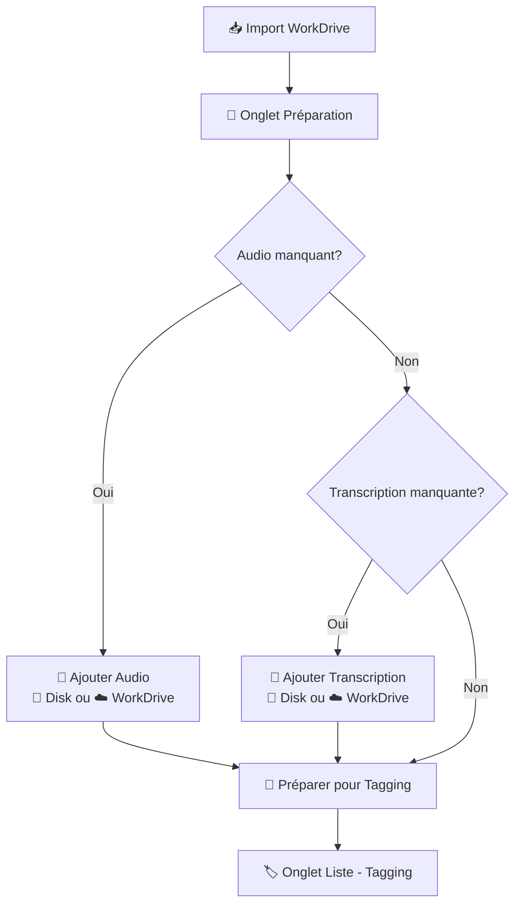

# 📞 Spécifications du Workflow des Appels - Page /calls (MISE À JOUR)

## 💡 **NOUVELLES SPÉCIFICATIONS - ONGLET PRÉPARATION**

### 🎯 **Modification majeure approuvée en session**

**Problème identifié** : Dans l'ancienne version, le bouton "Préparer" mélangeait deux responsabilités :

1. Compléter l'appel avec fichiers manquants (audio/transcription)
2. Transformer techniquement JSONB → tables `transcript`/`word`

**Solution** : Séparer ces responsabilités en deux colonnes distinctes.

## 🔄 **NOUVELLE ARCHITECTURE - SÉPARATION DES RESPONSABILITÉS**

### **Colonne 1 : Actions de Complément**

- **But** : Compléter l'appel avec les fichiers manquants
- **Boutons contextuels** :
  - 🎵 **"Ajouter Audio"** (si `upload = false`)
  - 📝 **"Ajouter Transcription"** (si `transcription = null`)
  - 👁️ **"Voir Contenu"** (toujours disponible)

### **Colonne Actions : Préparation Technique**

- **But** : Préparer techniquement l'appel pour le tagging
- **Bouton** : 🔧 **"Préparer pour Tagging"**
  - Transforme JSONB `call.transcription` → tables `transcript` + `word`
  - Marque `preparedfortranscript = true`
  - **Condition** : Disponible seulement si `transcription ≠ null`

## 🎨 **Interface Proposée - Table Préparation**

```
┌─ Actions Complément ─┬─ État ─┬─ Fichier ─┬─ Description ─┬─ Préparation ─┐
│ 🎵 Ajouter Audio     │🎵📝    │file.mp3   │ Description  │ [Préparer]   │
│ 📝 Ajouter Transc.   │Complet │           │              │              │
│ 👁️ Voir Contenu      │        │           │              │              │
├─────────────────────┼────────┼───────────┼──────────────┼──────────────┤
│ 🎵 Ajouter Audio     │📝      │file.json  │ Transcription│ [Préparer]   │
│ 👁️ Voir JSON         │Seule   │           │ seule        │              │
├─────────────────────┼────────┼───────────┼──────────────┼──────────────┤
│ 👁️ Voir Audio/JSON   │✅ Prêt │file.mp3   │ Déjà préparé│ [→ Liste]    │
│                     │        │           │              │              │
└─────────────────────┴────────┴───────────┴──────────────┴──────────────┘
```

## 📊 **États des Appels et Actions Disponibles**

### **État 1 : Audio seul**

```sql
upload = true, transcription = null, preparedfortranscript = false
```

- **Actions** : [📝 Ajouter Transcription] [👁️ Voir Audio]
- **Préparation** : ❌ **Pas disponible** (transcription requise)

### **État 2 : Transcription seule**

```sql
upload = false, transcription ≠ null, preparedfortranscript = false
```

- **Actions** : [🎵 Ajouter Audio] [👁️ Voir JSON]
- **Préparation** : ✅ **[Préparer pour Tagging]** disponible

### **État 3 : Audio + Transcription (complet)**

```sql
upload = true, transcription ≠ null, preparedfortranscript = false
```

- **Actions** : [👁️ Voir Audio] [👁️ Voir JSON]
- **Préparation** : ✅ **[Préparer pour Tagging]** disponible

### **État 4 : Préparé pour tagging**

```sql
preparedfortranscript = true
```

- **Actions** : [👁️ Voir] [🗑️ Supprimer]
- **Navigation** : ✅ **[→ Aller à Liste]** (redirect vers onglet 2)

## 🔧 **Nouveau Modal Upload Audio Amélioré**

### **Interface avec choix de source**

```typescript
interface AudioUploadModalProps {
  open: boolean;
  call?: Call;
  mode: "complement" | "preparation"; // Nouveau mode
  sources?: ("disk" | "workdrive")[]; // Sources disponibles
  onClose: () => void;
  onUpload: (file: File, call?: Call) => void;
}
```

### **Modal avec onglets**

```
┌─────────────────────────────────────┐
│ 🎵 Ajouter Audio - [Call #123]      │
├─────────────────────────────────────┤
│ [💾 Disque Dur] [☁️ WorkDrive]      │
├─────────────────────────────────────┤
│                                     │
│ Onglet Disque Dur:                  │
│ [Parcourir...] [Glisser-déposer]    │
│                                     │
│ OU                                  │
│                                     │
│ Onglet WorkDrive:                   │
│ SimpleWorkdriveExplorer             │
│ (mode audioOnly=true)               │
│                                     │
├─────────────────────────────────────┤
│         [Annuler] [Ajouter]         │
└─────────────────────────────────────┘
```

## 🔄 **Workflow Mis à Jour**



## 🛠️ **MODIFICATIONS TECHNIQUES DÉTAILLÉES**

### **1. SimpleWorkdriveExplorer.tsx - Props étendues**

```typescript
// ✅ MODIFICATION de l'interface existante
export interface SimpleWorkdriveExplorerProps {
  onFilesSelect: (audioFile: File | null, transcriptionText?: string) => void;
  rootFolderId?: string;
  // ✅ NOUVELLES PROPS
  audioOnly?: boolean; // Filtre seulement les fichiers audio
  transcriptionOnly?: boolean; // Filtre seulement les transcriptions
  mode?: "full" | "audio_only" | "transcription_only"; // Mode d'utilisation
  showSelectionSummary?: boolean; // Afficher/masquer le résumé de sélection
  maxSelections?: {
    audio: number;
    transcription: number;
  };
}

// ✅ MODIFICATION du composant principal
export default function SimpleWorkdriveExplorer({
  onFilesSelect,
  rootFolderId = ROOT_FOLDER_ID,
  audioOnly = false, // ✅ NOUVEAU
  transcriptionOnly = false, // ✅ NOUVEAU
  mode = "full", // ✅ NOUVEAU
  showSelectionSummary = true, // ✅ NOUVEAU
  maxSelections = { audio: 1, transcription: 1 }, // ✅ NOUVEAU
}: SimpleWorkdriveExplorerProps) {
  // ... logique existante inchangée

  // ✅ NOUVELLE LOGIQUE: Adaptation du comportement selon le mode
  useEffect(() => {
    // Désactiver la sélection selon le mode
    if (mode === "audio_only" || audioOnly) {
      setSelectedTranscriptionFile(null);
    }
    if (mode === "transcription_only" || transcriptionOnly) {
      setSelectedAudioFile(null);
    }
  }, [mode, audioOnly, transcriptionOnly]);

  // ✅ MODIFICATION: Gestionnaires de sélection avec contrôles
  const handleSelectAudioFile = (file: ZohoFile) => {
    if (mode === "transcription_only" || transcriptionOnly) return;

    setSelectedAudioFile(selectedAudioFile?.id === file.id ? null : file);
  };

  const handleSelectTranscriptionFile = (file: ZohoFile) => {
    if (mode === "audio_only" || audioOnly) return;

    setSelectedTranscriptionFile(
      selectedTranscriptionFile?.id === file.id ? null : file
    );
  };

  // ✅ MODIFICATION: Validation avant import
  const handleImportFiles = async () => {
    // Validation selon le mode
    if (mode === "audio_only" && !selectedAudioFile) {
      setError("Veuillez sélectionner un fichier audio");
      return;
    }
    if (mode === "transcription_only" && !selectedTranscriptionFile) {
      setError("Veuillez sélectionner une transcription");
      return;
    }
    if (mode === "full" && !selectedAudioFile && !selectedTranscriptionFile) {
      setError("Veuillez sélectionner au moins un fichier");
      return;
    }

    // ... logique d'import existante inchangée
  };

  // ✅ NOUVEAU: Interface adaptée selon le mode
  const getTitle = () => {
    switch (mode) {
      case "audio_only":
        return "Sélectionner un fichier audio";
      case "transcription_only":
        return "Sélectionner une transcription";
      default:
        return "Import de nouveaux appels depuis Zoho WorkDrive";
    }
  };

  const getDescription = () => {
    switch (mode) {
      case "audio_only":
        return "Parcourez WorkDrive et sélectionnez un fichier audio à ajouter.";
      case "transcription_only":
        return "Parcourez WorkDrive et sélectionnez une transcription à ajouter.";
      default:
        return "Utilisez l'explorateur ci-dessous pour parcourir votre Zoho WorkDrive et importer directement vos fichiers audio et transcriptions.";
    }
  };

  return (
    <Box sx={{ width: "100%" }}>
      {/* ✅ MODIFICATION: Titre et description adaptés */}
      {mode !== "full" && (
        <Box sx={{ mb: 2 }}>
          <Typography variant="h6" gutterBottom>
            {getTitle()}
          </Typography>
          <Typography variant="body2" color="textSecondary" paragraph>
            {getDescription()}
          </Typography>
        </Box>
      )}

      {/* ... Navigation et onglets inchangés ... */}

      {/* ✅ MODIFICATION: Résumé conditionnel */}
      {showSelectionSummary && (
        <FileSelectionSummary
          selectedAudioFile={selectedAudioFile}
          selectedTranscriptionFile={selectedTranscriptionFile}
          onClearAudioFile={() => setSelectedAudioFile(null)}
          onClearTranscriptionFile={() => setSelectedTranscriptionFile(null)}
          mode={mode} // ✅ NOUVEAU prop
        />
      )}

      {/* ✅ MODIFICATION: Bouton adapté selon le mode */}
      {(selectedAudioFile || selectedTranscriptionFile) && (
        <Paper
          elevation={2}
          sx={{ p: 2, mb: 2, bgcolor: "background.default" }}
        >
          <Button
            variant="contained"
            color="primary"
            onClick={handleImportFiles}
            disabled={processingImport}
            fullWidth
            sx={{ mt: 1 }}
          >
            {processingImport
              ? "Sélection en cours..."
              : mode === "audio_only"
              ? "Sélectionner cet audio"
              : mode === "transcription_only"
              ? "Sélectionner cette transcription"
              : "Importer les fichiers sélectionnés"}
          </Button>
        </Paper>
      )}

      {/* ✅ MODIFICATION: FileList avec filtrage */}
      {currentTab === 0 && (
        <FileList
          files={files}
          loading={loading}
          selectedAudioFile={selectedAudioFile}
          selectedTranscriptionFile={selectedTranscriptionFile}
          onFolderClick={handleFolderClick}
          onSelectAudioFile={handleSelectAudioFile}
          onSelectTranscriptionFile={handleSelectTranscriptionFile}
          mode={mode} // ✅ NOUVEAU prop
        />
      )}

      {/* ✅ MODIFICATION: SearchResults avec filtrage */}
      {currentTab === 1 && (
        <SearchResults
          searchResults={searchResults}
          selectedAudioFile={selectedAudioFile}
          selectedTranscriptionFile={selectedTranscriptionFile}
          onSelectAudioFile={handleSelectAudioFile}
          onSelectTranscriptionFile={handleSelectTranscriptionFile}
          allFiles={files}
          mode={mode} // ✅ NOUVEAU prop
        />
      )}

      {/* ... Notifications inchangées ... */}
    </Box>
  );
}
```

### **2. FileList.tsx - Filtrage par mode**

```typescript
// ✅ MODIFICATION de l'interface
interface FileListProps {
  files: ZohoFile[];
  loading: boolean;
  selectedAudioFile?: ZohoFile | null;
  selectedTranscriptionFile?: ZohoFile | null;
  onFolderClick: (folderId: string, folderName?: string) => void;
  onSelectAudioFile: (file: ZohoFile) => void;
  onSelectTranscriptionFile: (file: ZohoFile) => void;
  mode?: "full" | "audio_only" | "transcription_only"; // ✅ NOUVEAU
}

export const FileList: React.FC<FileListProps> = ({
  files,
  loading,
  selectedAudioFile,
  selectedTranscriptionFile,
  onFolderClick,
  onSelectAudioFile,
  onSelectTranscriptionFile,
  mode = "full", // ✅ NOUVEAU
}) => {
  // ✅ NOUVEAU: Filtrage des fichiers selon le mode
  const filteredFiles = useMemo(() => {
    if (!files) return [];

    return files.filter((file) => {
      if (!file || !file.id) return false;

      // Toujours afficher les dossiers pour navigation
      const isFolder =
        file.attributes?.type === "folder" ||
        file.attributes?.is_folder === true;

      if (isFolder) return true;

      // Filtrage selon le mode
      if (mode === "audio_only") {
        return isAudioFile(file);
      }
      if (mode === "transcription_only") {
        return isTranscriptionFile(file);
      }

      // Mode 'full': afficher tous les fichiers
      return true;
    });
  }, [files, mode]);

  // ✅ MODIFICATION: Utiliser filteredFiles au lieu de files
  return (
    <Box
      sx={{
        display: "grid",
        gridTemplateColumns: {
          xs: "1fr",
          sm: "repeat(2, 1fr)",
          md: "repeat(3, 1fr)",
        },
        gap: 2,
      }}
    >
      {filteredFiles.map((file) => {
        // ... logique existante inchangée pour le rendu des cartes

        return (
          <Card key={file.id} variant="outlined" /* ... styles ... */>
            <CardContent>
              {/* ... affichage existant inchangé ... */}

              <Box
                sx={{ mt: 1, display: "flex", justifyContent: "space-between" }}
              >
                {isFolder ? (
                  <Button
                    size="small"
                    variant="outlined"
                    color="primary"
                    onClick={() => onFolderClick(file.id, fileName)}
                    fullWidth
                    startIcon={<FolderIcon />}
                  >
                    Ouvrir
                  </Button>
                ) : (
                  <Box
                    sx={{
                      display: "flex",
                      width: "100%",
                      justifyContent: "space-around",
                    }}
                  >
                    {/* ✅ MODIFICATION: Boutons conditionnels selon le mode */}
                    {isAudio && (mode === "full" || mode === "audio_only") && (
                      <Button
                        size="small"
                        variant={
                          selectedAudioFile?.id === file.id
                            ? "contained"
                            : "outlined"
                        }
                        color="secondary"
                        onClick={() => onSelectAudioFile(file)}
                      >
                        {selectedAudioFile?.id === file.id
                          ? "Audio ✓"
                          : "Sélect. Audio"}
                      </Button>
                    )}
                    {isTranscription &&
                      (mode === "full" || mode === "transcription_only") && (
                        <Button
                          size="small"
                          variant={
                            selectedTranscriptionFile?.id === file.id
                              ? "contained"
                              : "outlined"
                          }
                          color="primary"
                          onClick={() => onSelectTranscriptionFile(file)}
                        >
                          {selectedTranscriptionFile?.id === file.id
                            ? "Transcript. ✓"
                            : "Sélect. Transcript."}
                        </Button>
                      )}
                  </Box>
                )}
              </Box>
            </CardContent>
          </Card>
        );
      })}
    </Box>
  );
};
```

### **3. FileSelectionSummary.tsx - Mode adaptatif**

```typescript
// ✅ MODIFICATION de l'interface
interface FileSelectionSummaryProps {
  selectedAudioFile: ZohoFile | null;
  selectedTranscriptionFile: ZohoFile | null;
  onClearAudioFile: () => void;
  onClearTranscriptionFile: () => void;
  mode?: "full" | "audio_only" | "transcription_only"; // ✅ NOUVEAU
}

export const FileSelectionSummary: React.FC<FileSelectionSummaryProps> = ({
  selectedAudioFile,
  selectedTranscriptionFile,
  onClearAudioFile,
  onClearTranscriptionFile,
  mode = "full", // ✅ NOUVEAU
}) => {
  // ✅ MODIFICATION: Affichage conditionnel selon le mode
  const shouldShowAudio =
    selectedAudioFile && (mode === "full" || mode === "audio_only");
  const shouldShowTranscription =
    selectedTranscriptionFile &&
    (mode === "full" || mode === "transcription_only");

  if (!shouldShowAudio && !shouldShowTranscription) {
    return null;
  }

  // ✅ MODIFICATION: Titre adapté selon le mode
  const getTitle = () => {
    switch (mode) {
      case "audio_only":
        return "Fichier audio sélectionné:";
      case "transcription_only":
        return "Transcription sélectionnée:";
      default:
        return "Fichiers sélectionnés:";
    }
  };

  return (
    <Paper sx={{ p: 2, mb: 3 }}>
      <Typography variant="subtitle1" gutterBottom>
        {getTitle()}
      </Typography>
      <Box sx={{ display: "flex", flexWrap: "wrap", gap: 1 }}>
        {shouldShowAudio && (
          <Chip
            icon={<AudioFileIcon />}
            label={`Audio: ${getFileName(selectedAudioFile)}`}
            color="secondary"
            onDelete={onClearAudioFile}
          />
        )}
        {shouldShowTranscription && (
          <Chip
            icon={<DescriptionIcon />}
            label={`Transcription: ${getFileName(selectedTranscriptionFile)}`}
            color="primary"
            onDelete={onClearTranscriptionFile}
          />
        )}
      </Box>
    </Paper>
  );
};
```

### **4. SearchResults.tsx - Filtrage adaptatif**

```typescript
// ✅ MODIFICATION: Même logique de filtrage que FileList
interface SearchResultsProps {
  searchResults: SearchResult;
  selectedAudioFile: ZohoFile | null;
  selectedTranscriptionFile: ZohoFile | null;
  onSelectAudioFile: (file: ZohoFile) => void;
  onSelectTranscriptionFile: (file: ZohoFile) => void;
  allFiles: ZohoFile[];
  mode?: "full" | "audio_only" | "transcription_only"; // ✅ NOUVEAU
}

// Dans le composant, appliquer le même filtrage que FileList
const filteredSearchResults = useMemo(() => {
  if (!searchResults.files) return [];

  return searchResults.files.filter((file) => {
    if (mode === "audio_only") return isAudioFile(file);
    if (mode === "transcription_only") return isTranscriptionFile(file);
    return true;
  });
}, [searchResults.files, mode]);
```

## 🔧 **UTILISATION DANS LE MODAL AUDIO**

### **AudioUploadModal.tsx - Intégration complète**

```typescript
const AudioUploadModal: React.FC<AudioUploadModalProps> = ({
  open,
  call,
  mode,
  sources = ["disk", "workdrive"],
  onClose,
  onUpload,
}) => {
  const [activeTab, setActiveTab] = useState(0);

  // ✅ Callback pour SimpleWorkdriveExplorer
  const handleWorkdriveSelection = (
    audioFile: File | null,
    transcriptionText?: string
  ) => {
    if (audioFile && call) {
      onUpload(audioFile, call);
      onClose(); // Fermer le modal après sélection
    }
  };

  return (
    <Dialog open={open} onClose={onClose} maxWidth="lg" fullWidth>
      <DialogTitle>
        🎵 Ajouter Audio {call && `- Appel #${call.callid}`}
      </DialogTitle>
      <DialogContent>
        <Tabs value={activeTab} onChange={(e, v) => setActiveTab(v)}>
          {sources.includes("disk") && <Tab label="💾 Disque Dur" />}
          {sources.includes("workdrive") && <Tab label="☁️ WorkDrive" />}
        </Tabs>

        <TabPanel value={activeTab} index={0}>
          <FileUploadZone onFileSelect={onUpload} accept="audio/*" />
        </TabPanel>

        <TabPanel value={activeTab} index={1}>
          {/* ✅ UTILISATION avec les nouvelles props */}
          <SimpleWorkdriveExplorer
            mode="audio_only" // ✅ Mode spécifique
            showSelectionSummary={true}
            onFilesSelect={handleWorkdriveSelection}
            maxSelections={{ audio: 1, transcription: 0 }}
          />
        </TabPanel>
      </DialogContent>
      <DialogActions>
        <Button onClick={onClose}>Annuler</Button>
      </DialogActions>
    </Dialog>
  );
};
```

## 🎯 **EXEMPLES D'UTILISATION**

### **1. Mode Audio Only (dans modal)**

```typescript
<SimpleWorkdriveExplorer
  mode="audio_only"
  showSelectionSummary={true}
  onFilesSelect={(audioFile) => {
    if (audioFile) handleAudioUpload(audioFile);
  }}
/>
```

### **2. Mode Transcription Only**

```typescript
<SimpleWorkdriveExplorer
  mode="transcription_only"
  showSelectionSummary={true}
  onFilesSelect={(_, transcriptionText) => {
    if (transcriptionText) handleTranscriptionUpload(transcriptionText);
  }}
/>
```

### **3. Mode Complet (existant)**

```typescript
<SimpleWorkdriveExplorer
  mode="full" // ou omis (par défaut)
  onFilesSelect={handleWorkdriveFilesSelect}
/>
```

## 🎯 **Cas d'Usage Détaillés**

### **Scénario A : Transcription seule → Ajout audio**

1. **État initial** : `upload=false, transcription≠null`
2. **Interface** : Bouton [🎵 Ajouter Audio] visible
3. **Action utilisateur** : Clique sur bouton
4. **Modal** : S'ouvre avec onglets Disk/WorkDrive
5. **Sélection** : Utilisateur choisit audio (disk ou WorkDrive)
6. **Upload** : Fichier uploadé dans bucket "Calls"
7. **Mise à jour** : `upload=true, filepath=path, audiourl=signedUrl`
8. **Résultat** : Bouton [🔧 Préparer] devient disponible

### **Scénario B : Audio seul → Ajout transcription**

1. **État initial** : `upload=true, transcription=null`
2. **Interface** : Bouton [📝 Ajouter Transcription] visible
3. **Action utilisateur** : Clique sur bouton
4. **Modal** : Modal upload transcription (JSON/TXT)
5. **Validation** : JSON validé avec `validateTranscriptionJSON`
6. **Mise à jour** : `transcription=parsedJSON`
7. **Résultat** : Bouton [🔧 Préparer] devient disponible

### **Scénario C : Préparation technique**

1. **Prérequis** : `transcription ≠ null`
2. **Action** : Clique sur [🔧 Préparer pour Tagging]
3. **Traitement** :
   - Création ligne dans `transcript`
   - Parsing JSONB → insertion dans `word`
   - `preparedfortranscript = true`
4. **Résultat** : Appel disponible dans onglet "Liste"

## 🔍 **Avantages de cette Nouvelle Architecture**

### **1. Séparation des Responsabilités**

- **Complément** : Actions métier (ajouter fichiers)
- **Préparation** : Actions techniques (transformation données)

### **2. UX Intuitive**

- Actions contextuelles selon l'état de l'appel
- Progression visuelle claire : Complément → Préparation → Tagging

### **3. Flexibilité des Sources**

- Upload depuis disque dur local
- Import depuis Zoho WorkDrive
- Extensible vers d'autres sources

### **4. Évolutivité**

- Facile d'ajouter nouvelles sources (FTP, S3, etc.)
- Structure modulaire pour nouveaux types de fichiers
- Composants réutilisables

### **5. Cohérence**

- Même interface WorkDrive dans import et complément
- Logique de validation identique
- Gestion d'erreurs unifiée

## 🧪 **Tests à Implémenter**

### **Tests Unitaires**

1. **ComplementActionButtons** : Affichage conditionnel des boutons
2. **AudioUploadModal** : Fonctionnement des onglets
3. **SimpleWorkdriveExplorer** : Filtrage audioOnly
4. **CallPreparation** : États et transitions

### **Tests d'Intégration**

1. **Workflow complet** : Import → Complément → Préparation → Tagging
2. **Gestion d'erreurs** : Upload failures, validation errors
3. **Performance** : Upload gros fichiers audio

### **Tests E2E**

1. **Scénario utilisateur** : Complètement un appel incomplet
2. **Multi-sources** : Alternance disk/WorkDrive
3. **États persistants** : Refresh page, navigation

## 🚨 **Points d'Attention pour l'Implémentation**

### **1. Gestion des États de Chargement**

```typescript
const [uploadingAudio, setUploadingAudio] = useState<string | null>(null);
const [preparingCall, setPreparingCall] = useState<string | null>(null);

// Disable buttons pendant traitement
<Button
  disabled={uploadingAudio === call.callid}
  loading={uploadingAudio === call.callid}
>
  {uploadingAudio === call.callid ? "Upload..." : "Ajouter Audio"}
</Button>;
```

### **2. Validation Robuste**

```typescript
// Validation audio
const isValidAudioFile = (file: File) => {
  const validTypes = ["audio/mp3", "audio/wav", "audio/m4a"];
  const maxSize = 100 * 1024 * 1024; // 100MB

  return validTypes.includes(file.type) && file.size <= maxSize;
};

// Validation transcription
const isValidTranscription = (text: string) => {
  const result = validateTranscriptionJSON(text);
  return result.isValid;
};
```

### **3. Gestion des Erreurs Spécifiques**

```typescript
// Erreurs réseau
try {
  await uploadAudio(file);
} catch (error) {
  if (error.code === "NETWORK_ERROR") {
    showMessage("Erreur réseau - Vérifiez votre connexion");
  } else if (error.code === "FILE_TOO_LARGE") {
    showMessage("Fichier trop volumineux (max 100MB)");
  } else {
    showMessage(`Erreur d'upload: ${error.message}`);
  }
}
```

### **4. Performance et UX**

```typescript
// Progress bars pour uploads
const [uploadProgress, setUploadProgress] = useState<{
  [callId: string]: number;
}>({});

// Débounce pour éviter clics multiples
const debouncedPrepareCall = useCallback(
  debounce(async (callId: string) => {
    await prepareCallForTagging(callId);
  }, 1000),
  []
);
```

---

## 📋 **Notes de Session pour Claude**

**Session Date** : Discussions avec utilisateur sur amélioration UX onglet Préparation

**Problème identifié** : Bouton "Préparer" mélangeait complément de fichiers et préparation technique

**Solution validée** : Séparation en deux colonnes distinctes avec modal multi-sources (disk/WorkDrive)

**Status** : Spécifications approuvées, implémentation à faire

**Priorité** : Haute - Amélioration UX significative

**Composants impactés** :

- `CallPreparation.tsx` (refactoring majeur)
- `AudioUploadModal.tsx` (extension)
- `SimpleWorkdriveExplorer.tsx` (nouveaux props)
- Nouveaux composants : `ComplementActionButtons.tsx`

**Tests requis** : Workflow complet, sources multiples, états persistants
